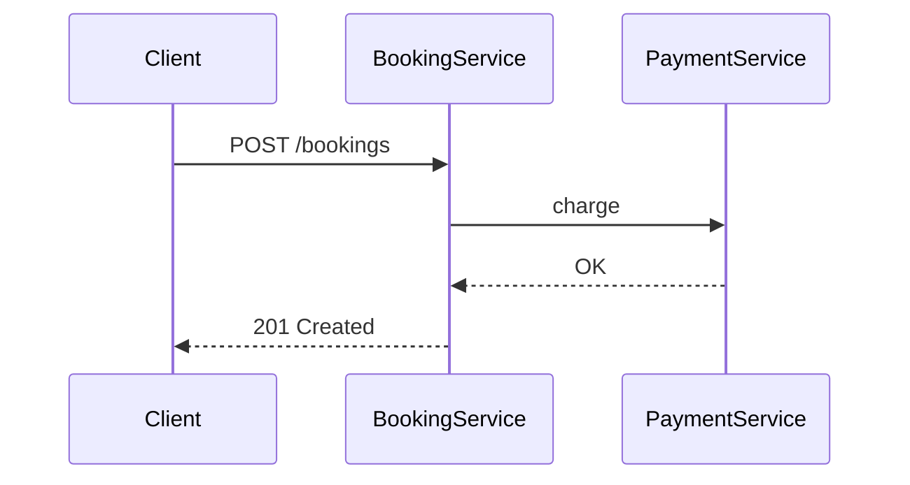
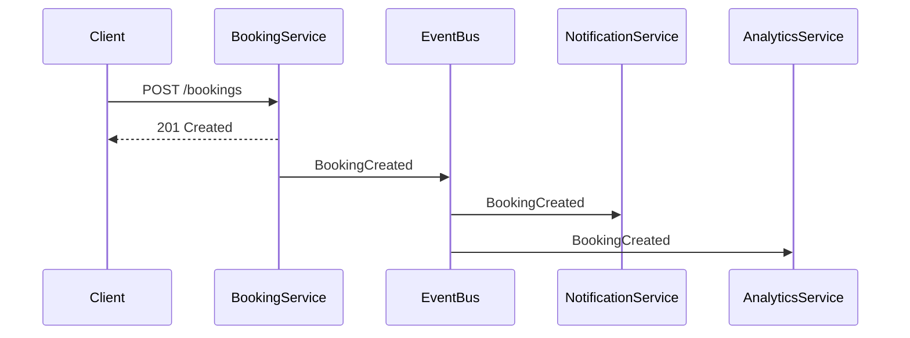
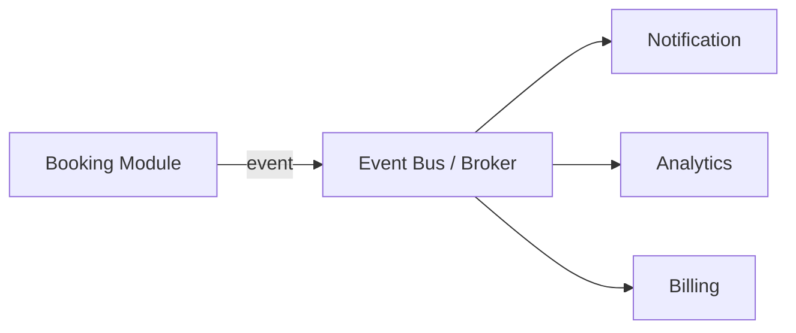
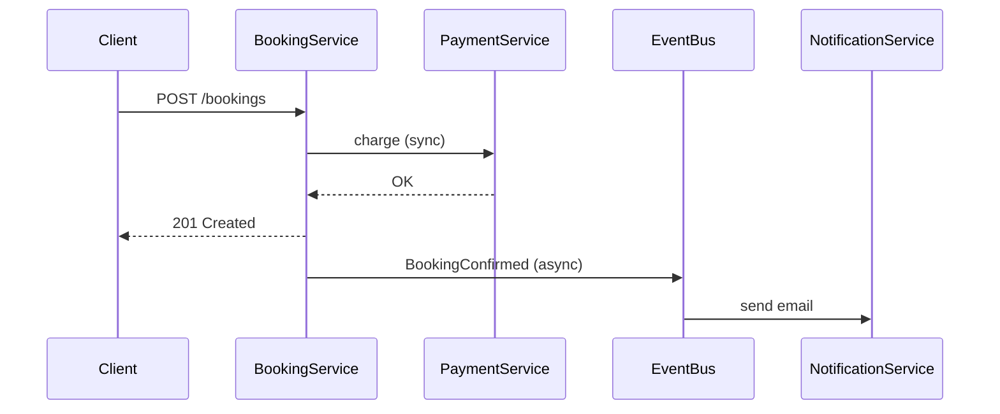

# Патерни комунікації між компонентами

## Зміст

- [Вступ](#вступ)
- [Синхронна комунікація](#синхронна-комунікація)
- [Асинхронна комунікація](#асинхронна-комунікація)
- [Порівняння](#порівняння)
- [Гібридний підхід](#гібридний-підхід)
- [Coupling: зв'язаність через комунікацію](#coupling-звязаність-через-комунікацію)
- [Поширені міфи](#поширені-міфи)
- [Джерела](#джерела)

---

## Вступ

Поки система — один компонент, питання комунікації не існує. Метод викликає метод, і все. Але щойно з'являються **окремі відповідальності** — модулі, сервіси, контексти — виникає питання: як вони спілкуються?

Уявіть: бронювання створено. Після цього потрібно надіслати email, оновити аналітику, зарезервувати оплату. Три побічні операції. Як їх виконати?

Варіант 1 — handler послідовно викликає кожен компонент. Простий, але якщо email-сервіс впаде — бронювання не створюється. Клієнт чекає 5 секунд замість 200мс.

Варіант 2 — handler публікує подію, а компоненти реагують самостійно. Бронювання створюється миттєво. Email приходить через секунду. Аналітика оновлюється через дві. А якщо email-сервіс впав — бронювання все одно створене, email відправиться пізніше.

Це і є два фундаментальних підходи: синхронна та асинхронна комунікація.

---

## Синхронна комунікація

При синхронній комунікації відправник **чекає відповіді** від отримувача перед тим, як продовжити роботу.



### Способи реалізації

**Прямий виклик (in-process)**

Один компонент викликає метод іншого через інтерфейс:

```python
class CreateBookingHandler:
    def __init__(self, repo: BookingRepository,
                 payment_service: PaymentService):
        self._repo = repo
        self._payment_service = payment_service

    def handle(self, command: CreateBookingCommand) -> str:
        booking = self._create_booking(command)
        self._payment_service.charge(booking.user_id, booking.total)
        self._repo.save(booking)
        return booking.id
```

Простіший варіант. Компоненти в одному процесі. Але `CreateBookingHandler` **знає** про `PaymentService` і **залежить** від нього.

**HTTP / REST**

Компоненти спілкуються через HTTP-запити. Кожен може бути окремим процесом або сервісом:

```python
class PaymentClient(PaymentService):
    def __init__(self, base_url: str):
        self._base_url = base_url

    def charge(self, user_id: str, amount: Decimal) -> PaymentResult:
        response = requests.post(
            f"{self._base_url}/payments",
            json={"user_id": user_id, "amount": str(amount)},
            timeout=5,
        )
        response.raise_for_status()
        return PaymentResult.from_dict(response.json())
```

**gRPC**

Бінарний протокол з суворою типізацією через Protocol Buffers. Швидший за REST, контракт визначається `.proto` файлом. Зручний для комунікації між сервісами, де важлива швидкість і типобезпека.

### Проблеми синхронної комунікації

| Проблема | Опис |
|----------|------|
| **Temporal coupling** | Якщо отримувач недоступний — відправник також не може завершити операцію |
| **Каскадна латентність** | Загальний час = сума часів усіх викликів у ланцюжку |
| **Тісна зв'язаність** | Відправник знає адресу, API та контракт отримувача |
| **Каскадний збій** | Збій одного сервісу поширюється на всіх, хто від нього залежить |

### Коли підходить

- Результат потрібен **негайно** (перевірка оплати перед підтвердженням бронювання)
- Операція має бути **атомарною** (або все, або нічого)
- Компонентів мало, затримка не критична
- Необхідна **негайна консистентність** даних

---

## Асинхронна комунікація

При асинхронній комунікації відправник **не чекає відповіді**. Повідомлення передається через проміжний компонент, отримувач обробляє його незалежно.



Клієнт отримує відповідь **одразу**. Побічні ефекти відбуваються у фоні.

### Способи реалізації

**In-process Event Bus**

Для моноліту — диспетчер подій усередині одного процесу. Найпростіший варіант, не потребує зовнішньої інфраструктури:

```python
class EventBus:
    def __init__(self):
        self._handlers: dict[type, list[Callable]] = {}

    def subscribe(self, event_type: type, handler: Callable) -> None:
        self._handlers.setdefault(event_type, []).append(handler)

    def publish(self, event: DomainEvent) -> None:
        for handler in self._handlers.get(type(event), []):
            handler(event)
```

**Message Broker (RabbitMQ, Kafka, Redis Streams)**

Зовнішній компонент, який приймає повідомлення від відправника і доставляє отримувачам. Дає гарантії доставки, персистенцію повідомлень, масштабування.

### Патерни

**Fire-and-Forget**

Відправник публікує повідомлення і не очікує жодного підтвердження. Найпростіший, але без гарантій обробки.

**Publish/Subscribe (Pub/Sub)**

Відправник публікує подію, усі підписники її отримують. Відправник **не знає**, хто підписаний — і не повинен:



Додати нового підписника = додати підписку. Відправник не змінюється. Це і є слабка зв'язаність.

**Request/Reply через чергу**

Асинхронний аналог синхронного запиту: відправник публікує запит у одну чергу, отримувач відповідає в іншу. Рідко використовується, складніший за прямий виклик.

### Проблеми асинхронної комунікації

| Проблема | Опис |
|----------|------|
| **Складність відлагодження** | Потік розподілений, немає єдиного call stack |
| **Eventual consistency** | Дані не одразу консистентні між компонентами |
| **Обробка помилок** | Що робити, якщо підписник не зміг обробити подію? Retry? Dead letter queue? |
| **Ідемпотентність** | Повідомлення може бути доставлене більше одного разу |
| **Порядок повідомлень** | Не гарантується (залежить від брокера) |

### Коли підходить

- Побічна операція **може бути відкладена** (нотифікація, аналітика, аудит)
- Потрібно **сповістити кілька компонентів** однією дією
- Важлива **відмовостійкість** — основна операція не повинна залежати від доступності побічних
- Компоненти мають бути **слабко зв'язані** (не знати одне про одного)

Для реалізації асинхронної комунікації використовуються [події](events.md).

---

## Порівняння

| Критерій | Синхронна | Асинхронна |
|----------|-----------|------------|
| Зв'язаність | Висока — знає адресу і API | Низька — знає лише формат події |
| Час відповіді клієнту | Сума часів усіх викликів | Лише основна операція |
| Доступність | Падає, якщо залежність недоступна | Працює, повідомлення чекає |
| Складність | Низька | Вища (брокер, помилки, ідемпотентність) |
| Відлагодження | Простіше — один потік | Складніше — розподілений потік |
| Консистентність | Негайна (strong) | Відкладена (eventual) |
| Масштабування | Обмежене ланцюжком | Кожен підписник масштабується окремо |

---

## Гібридний підхід

На практиці в одній системі зазвичай є і синхронна, і асинхронна комунікація. Вибір — **на рівні конкретної операції**, а не на рівні всієї системи.



- Оплата — **синхронно** (потрібен результат зараз, без оплати немає бронювання)
- Нотифікація — **асинхронно** (email може зачекати секунду)

### Як прийняти рішення?

Для кожної побічної операції запитайте:

1. **Чи потрібен результат одразу?** Так → синхронно
2. **Чи може основна операція завершитися без цього?** Так → асинхронно
3. **Чи критичний збій цього компонента?** Так → синхронно (або saga)
4. **Чи потрібно сповістити кілька споживачів?** Так → асинхронно (pub/sub)

---

## Coupling: зв'язаність через комунікацію

Спосіб комунікації визначає рівень зв'язаності між компонентами:

### Синхронний прямий виклик — максимальна зв'язаність

```python
class CreateBookingHandler:
    def __init__(self, notification_service: NotificationService):
        self._notification_service = notification_service  # знає про нотифікації

    def handle(self, command):
        booking = ...
        self._notification_service.send_confirmation(booking)  # прямий виклик
```

Handler **знає**, що існує Notification Service, і **залежить** від його інтерфейсу.

### Подія через Event Bus — мінімальна зв'язаність

```python
class CreateBookingHandler:
    def __init__(self, event_bus: EventBus):
        self._event_bus = event_bus  # знає лише про Event Bus

    def handle(self, command):
        booking = ...
        self._event_bus.publish(BookingCreated(...))  # не знає, хто підписаний
```

Handler **не знає** про Notification Service. Він публікує факт — «бронювання створено». Хто на це реагує — не його справа. Додати нового підписника, видалити існуючого — handler не змінюється.

Це і є головна перевага асинхронної комунікації через події: **відправник і отримувач не знають одне про одного**.

---

## Поширені міфи

### «Асинхронна комунікація завжди краща за синхронну»

Ні. Асинхронна додає складність: eventual consistency, ідемпотентність, обробка помилок, відлагодження розподілених потоків. Якщо потрібна негайна відповідь і система проста — синхронний виклик через інтерфейс цілком прийнятний.

### «Для асинхронної комунікації потрібен RabbitMQ / Kafka»

Не обов'язково. Для моноліту достатньо in-process Event Bus — це кілька десятків рядків коду. Зовнішній брокер потрібен, коли компоненти — окремі процеси, або потрібні гарантії персистенції повідомлень.

### «Синхронний виклик = HTTP»

Ні. Синхронний виклик — це будь-який виклик, де відправник чекає відповіді. Прямий виклик методу через інтерфейс (in-process) — теж синхронний, без HTTP. HTTP — це транспорт, а не патерн комунікації.

### «Pub/Sub вирішує всі проблеми зв'язаності»

Pub/Sub зменшує зв'язаність між відправником і отримувачем. Але з'являється зв'язаність через **контракт події**: якщо змінити структуру події, зламаються всі підписники. Контракт подій — це API, яке потрібно версіонувати та підтримувати.

### «Eventual consistency — це проблема»

Це не проблема, а **свідомий trade-off**. Ви обмінюєте негайну консистентність на доступність, слабку зв'язаність і продуктивність. Для більшості побічних операцій (email, аналітика, аудит) затримка в секунди абсолютно прийнятна.

---

## Джерела

- **Gregor Hohpe, Bobby Woolf** — *Enterprise Integration Patterns* (2003) — фундаментальна книга про патерни обміну повідомленнями (Pub/Sub, Message Channel, Request-Reply тощо)
- **Sam Newman** — *Building Microservices* (2nd edition, 2021) — синхронна vs асинхронна комунікація між сервісами, trade-offs, практичні рекомендації
- **Martin Fowler** — [What do you mean by "Event-Driven"?](https://martinfowler.com/articles/201701-event-driven.html) — стаття про різні значення event-driven архітектури
- **Robert C. Martin** — *Clean Architecture* (2017) — про межі між компонентами та способи їх перетину
