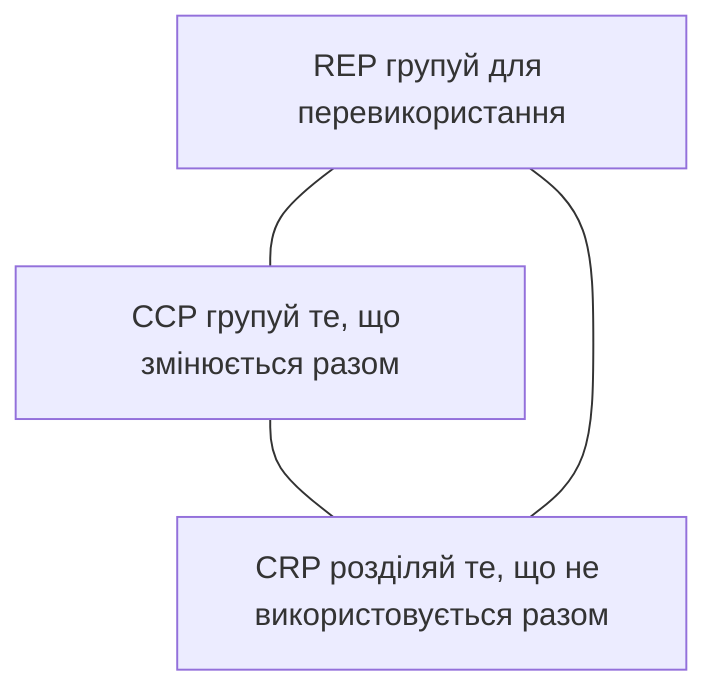
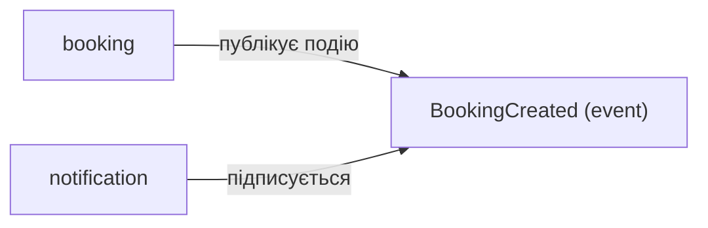
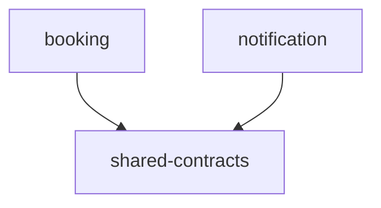
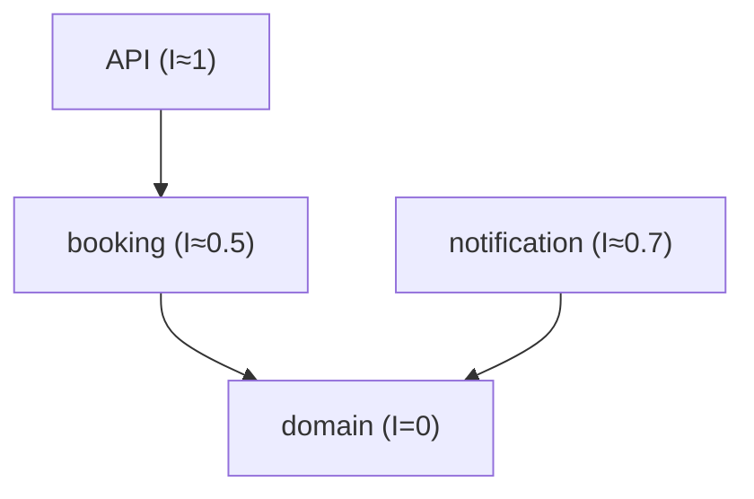

# Принципи компонентної архітектури

## Зміст

- [Вступ](#вступ)
- [Що таке компонент](#що-таке-компонент)
- [Принципи зв'язності (Cohesion)](#принципи-звязності-cohesion)
  - [REP — Reuse/Release Equivalence Principle](#rep--reuserelease-equivalence-principle)
  - [CCP — Common Closure Principle](#ccp--common-closure-principle)
  - [CRP — Common Reuse Principle](#crp--common-reuse-principle)
  - [Tension Triangle](#tension-triangle)
- [Принципи сполучення (Coupling)](#принципи-сполучення-coupling)
  - [ADP — Acyclic Dependencies Principle](#adp--acyclic-dependencies-principle)
  - [SDP — Stable Dependencies Principle](#sdp--stable-dependencies-principle)
  - [SAP — Stable Abstractions Principle](#sap--stable-abstractions-principle)
- [Як принципи працюють разом](#як-принципи-працюють-разом)
- [Поширені міфи](#поширені-міфи)
- [Джерела](#джерела)

---

## Вступ

[SOLID](solid.md) допомагає організувати код на рівні класів та інтерфейсів: як розділити відповідальності, від чого залежити, як проєктувати абстракції. Але коли система росте — класів стає десятки, сотні. Їх потрібно якось **групувати** у більші одиниці: модулі, пакети, бібліотеки. І тут виникають питання іншого рівня.

Які класи покласти в один пакет? Якщо `BookingRepository` і `SmtpNotifier` живуть в одному модулі — зміна SMTP-провайдера змусить перезбирати і перетестовувати код бронювання. Якщо модуль `analytics` залежить від `booking`, а `booking` — від `analytics` — будь-яка зміна в одному тягне за собою інший. Якщо модуль, від якого залежать усі, часто змінюється — кожна зміна каскадно ламає половину системи.

Robert C. Martin сформулював **6 принципів** організації компонентів у книзі *Clean Architecture* (2017). Вони діляться на дві групи:

- **Cohesion** (зв'язність) — які класи об'єднувати в один компонент
- **Coupling** (сполучення) — як компоненти мають залежати одне від одного

---

## Що таке компонент

Компонент — це одиниця deployment та групування: пакет у Python, модуль у Go, JAR у Java, npm-пакет у JS. У контексті [модульного моноліту](modular-monolith.md) компонент — це bounded context або модуль. Головне — це щось, що має **межу** і може бути виділене як окрема одиниця.

```
src/
├── booking/          # компонент
├── analytics/        # компонент
├── notification/     # компонент
└── shared/           # компонент (спільні абстракції)
```

---

## Принципи зв'язності (Cohesion)

Ці три принципи відповідають на питання: **які класи мають жити в одному компоненті?**

### REP — Reuse/Release Equivalence Principle

> Одиниця повторного використання дорівнює одиниці релізу.

#### Проблема

Ви хочете перевикористати `TimeSlot` (Value Object) і `BookingValidator` з модуля бронювання в іншому проєкті. Але вони живуть в одному пакеті з `PostgresBookingRepository`, `SmtpNotifier` і конфігурацією SMTP. Щоб отримати два корисних класи — потрібно тягнути весь пакет із залежностями на SQLAlchemy та smtplib.

#### Рішення

Класи, що перевикористовуються разом, мають бути **релізнуті разом**. Компонент — це мінімальна одиниця, яку можна підключити як залежність. Усе всередині компонента має бути пов'язаним за змістом, мати спільне версіонування і спільний цикл релізу.

```
# Добре: кожен компонент — це цілісна, перевикористовувана одиниця
booking-domain/        # TimeSlot, Booking, BookingValidator, BookingRepository (Protocol)
booking-infrastructure/ # PostgresBookingRepository, ORM-моделі
notification/          # SmtpNotifier, NotificationService
```

#### Суть

REP — це орієнтир для **мінімального розміру** компонента. Якщо ви не можете дати компоненту чітку версію і описати, що в нього входить — він занадто дрібний або занадто хаотичний.

---

### CCP — Common Closure Principle

> Класи, що змінюються з однієї причини і в один час, мають бути в одному компоненті.

Це [SRP](solid.md), але на рівні компонентів. SRP каже: клас має одну причину для зміни. CCP каже: **компонент** має одну причину для зміни.

#### Проблема

Зміна бізнес-правила «бронювання можна скасувати лише за 24 години» торкається `BookingValidator`, `CancelBookingHandler` і `BookingPolicy`. Якщо вони розкидані по трьох різних пакетах — одна бізнес-зміна вимагає релізу трьох компонентів.

#### Рішення

Групувати класи, які змінюються разом:

```
booking/
├── domain/
│   ├── entities.py         # Booking 
│   ├── value-objects.py    # TimeSlot
│   ├── policies.py         # BookingPolicy (правило 24 годин)
│   └── repositories.py     # BookingRepository (Protocol)
├── application/
│   ├── create_booking.py   # CreateBookingHandler
│   └── cancel_booking.py   # CancelBookingHandler
└── infrastructure/
    └── repositories.py     # PostgresBookingRepository
```

Зміна бізнес-правила торкнеться лише пакету `booking/`. Інші компоненти (`analytics/`, `notification/`) не змінюються, не перезбираються, не перетестовуються.

#### Суть

CCP — про **мінімізацію кількості компонентів, які потрібно змінити** при одній бізнес-зміні. Класи, що змінюються разом — живуть разом.

---

### CRP — Common Reuse Principle

> Не змушуй користувача компонента залежати від того, що йому не потрібно.

Це [ISP](solid.md), але на рівні компонентів. ISP каже: клієнт не повинен залежати від методів, які не використовує. CRP каже: клієнт компонента не повинен залежати від **класів**, які не використовує.

#### Проблема

Модуль `analytics` імпортує `BookingDTO` із пакету `booking`. Але `booking` також містить `SmtpNotifier`, `PostgresBookingRepository` і залежності на SQLAlchemy та smtplib. Оновлення smtplib або SQLAlchemy змусить перезбирати і перетестовувати `analytics`, хоча він не використовує жодного з цих класів.

#### Рішення

Якщо класи не використовуються разом — вони не повинні бути в одному компоненті:

```
booking-contracts/      # BookingDTO, BookingCreated (event) — те, що потрібно споживачам
booking/                # внутрішня логіка, ORM, SMTP — нікого не стосується
```

`analytics` залежить лише від `booking-contracts`, а не від усього `booking`.

#### Суть

CRP — це орієнтир для **максимального розміру** компонента. Він каже, що **не** класти разом: класи, які не перевикористовуються спільно, не мають жити в одному компоненті.

---

### Tension Triangle

REP, CCP і CRP створюють **тріаду напруги** — вони тягнуть рішення в різні боки:



- **REP + CCP** (без CRP): великі компоненти, де все зв'язане — але з'являються непотрібні залежності для споживачів
- **CCP + CRP** (без REP): компоненти важко перевикористовувати — занадто дрібні або нелогічно згруповані
- **REP + CRP** (без CCP): багато маленьких компонентів — одна бізнес-зміна торкається десятка пакетів

Ідеального балансу немає. На ранніх етапах проєкту важливіші CCP (менше компонентів, що змінюються) і REP. З ростом системи та кількості споживачів зростає значення CRP.

---

## Принципи сполучення (Coupling)

Ці три принципи відповідають на питання: **як компоненти мають залежати одне від одного?**

### ADP — Acyclic Dependencies Principle

> У графі залежностей між компонентами не повинно бути циклів.

#### Проблема

`booking` залежить від `notification` (щоб надіслати підтвердження). `notification` залежить від `booking` (щоб отримати деталі бронювання). Цикл:


Наслідки:
- Неможливо зібрати один компонент без іншого
- Зміна в `booking` каскадно впливає на `notification`, і навпаки
- Тестування `booking` тягне за собою `notification` і навпаки
- Фактично це один великий компонент, розбитий на два пакети

#### Рішення

**Інверсія залежності через [DIP](solid.md)**. Виділити інтерфейс, від якого залежать обидва:



`booking` публікує [доменну подію](domain-events.md) `BookingCreated`. `notification` підписується на неї. Прямої залежності немає — цикл розірвано.

**Виділення спільного компонента**. Якщо обидва залежать від однієї моделі — виділити її в окремий пакет:



#### Суть

Циклічні залежності між компонентами перетворюють модульну систему на моноліт. Якщо цикл виник — це сигнал, що межі проведені неправильно або відсутня абстракція. [Доменні події](domain-events.md) та спільні контракти — типові способи розірвати цикл.

---

### SDP — Stable Dependencies Principle

> Залежності мають бути направлені в бік **стабільності**.

#### Проблема

Модуль `booking-domain` (моделі, інваріанти, інтерфейси репозиторіїв) залежить від `notification-infrastructure` (SMTP-клієнт, шаблони email). Шаблони email змінюються щотижня — і кожна зміна потенційно впливає на доменну логіку бронювання.

Нестабільний компонент (що часто змінюється) став залежністю стабільного (що змінюється рідко). Хвіст крутить собакою.

#### Як виміряти стабільність?

Martin вводить метрику **нестабільності** (Instability):

```
I = Fan-out / (Fan-in + Fan-out)
```

- **Fan-in** — кількість компонентів, які залежать **від** цього компонента
- **Fan-out** — кількість компонентів, від яких залежить **цей** компонент
- **I = 0** — максимально стабільний (від нього залежать всі, він — ні від кого)
- **I = 1** — максимально нестабільний (він залежить від усіх, від нього — ніхто)

Приклад:

| Компонент | Fan-in | Fan-out | I (нестабільність) |
|-----------|--------|---------|-----|
| `domain` | 3 (booking, analytics, notification залежать від нього) | 0 | 0.0 (стабільний) |
| `booking` | 1 (API залежить від нього) | 2 (domain, infrastructure) | 0.67 |
| `notification-infra` | 1 (notification) | 1 (email-provider) | 0.5 |

#### Рішення

Залежності мають вести **від нестабільних компонентів до стабільних**:



Стабільні компоненти (domain) внизу, нестабільні (API, notification) — зверху. Зміни у нестабільних компонентах не каскадують до стабільних.

#### Суть

SDP формалізує інтуїтивне правило: **те, від чого залежать багато, має змінюватись рідко**. Якщо стабільний компонент залежить від нестабільного — потрібно інвертувати залежність через абстракцію ([DIP](solid.md)).

---

### SAP — Stable Abstractions Principle

> Стабільність компонента має бути пропорційна його абстрактності.

#### Проблема

Компонент `domain` — стабільний (від нього залежать усі). Але він повністю складається з конкретних класів без інтерфейсів. Щоб розширити систему — потрібно **змінити** domain. А він стабільний — зміни в ньому каскадно впливають на все. Стабільний компонент без абстракцій — це **бетонна стіна**: надійна, але її неможливо адаптувати.

Інший випадок: компонент `notification-infra` — нестабільний (часто змінюється), але складається виключно з абстрактних інтерфейсів. Абстракції без реалізації у нестабільному компоненті — це марнотратство.

#### Рішення

Стабільні компоненти мають бути **абстрактними** (містити інтерфейси, які можна розширювати без модифікації — [OCP](solid.md)):

```python
# domain/repositories.py — стабільний, абстрактний
class BookingRepository(Protocol):
    def save(self, booking: Booking) -> None: ...
    def find_by_id(self, booking_id: str) -> Booking | None: ...
```

Нестабільні компоненти мають бути **конкретними** (містити реалізації, які легко змінювати):

```python
# infrastructure/postgres_repo.py — нестабільний, конкретний
class PostgresBookingRepository:
    def save(self, booking: Booking) -> None:
        # конкретна реалізація, яка може змінюватись
        ...
```

Martin вводить метрику **абстрактності** (Abstractness):

```
A = кількість абстрактних класів та інтерфейсів / загальна кількість класів
```

І визначає **Main Sequence** — лінію, де I + A ≈ 1:

| Зона | I (нестабільність) | A (абстрактність) | Проблема |
|------|-----|----|---------|
| Zone of Pain | 0 (стабільний) | 0 (конкретний) | Важко змінювати, але від нього залежать усі |
| Zone of Uselessness | 1 (нестабільний) | 1 (абстрактний) | Ніхто не залежить, а він весь з інтерфейсів |
| Main Sequence | I + A ≈ 1 | | Здоровий баланс |

#### Суть

SAP — це зв'язка між стабільністю та розширюваністю. Стабільний компонент, від якого залежать усі, має давати можливість розширення без модифікації — тобто бути абстрактним. Нестабільний компонент може бути конкретним — його легко змінити, бо від нього мало хто залежить.

---

## Як принципи працюють разом

Шість принципів — це система:

**Cohesion** вирішує, що класти в один компонент:
- **REP**: те, що перевикористовується та релізиться разом
- **CCP**: те, що змінюється з однієї причини
- **CRP**: не класти те, що не використовується разом

**Coupling** вирішує, як компоненти залежать одне від одного:
- **ADP**: без циклів — інакше це не окремі компоненти
- **SDP**: залежності до стабільних — нестабільне не має бути фундаментом
- **SAP**: стабільне має бути абстрактним — інакше його неможливо розширити

Разом із [SOLID](solid.md) вони покривають два рівні проєктування:
- **SOLID** — мікрорівень: як організувати класи та інтерфейси
- **Component Principles** — макрорівень: як організувати компоненти та залежності між ними

У контексті [шарової архітектури](layered-architecture.md): Domain Layer — стабільний і абстрактний (SAP). Infrastructure — нестабільний і конкретний (SDP). Залежності направлені від нестабільного до стабільного (SDP), без циклів (ADP). Кожен [модуль](modular-monolith.md) згрупований за бізнес-причиною зміни (CCP), не тягне зайвих залежностей (CRP), і є цілісною одиницею для перевикористання (REP).

---

## Поширені міфи

### «Ці принципи — лише для мікросервісів»

Принципи компонентної архітектури працюють на будь-якому рівні групування: пакети в моноліті, модулі в [модульному моноліті](modular-monolith.md), npm-пакети, бібліотеки. Мікросервіси — лише один з варіантів deployment. ADP (без циклів) і SDP (залежності до стабільного) однаково актуальні для пакетів всередині одного процесу.

### «Якщо дотримуватись CCP — компоненти стануть занадто великими»

CCP каже: групуй те, що змінюється з однієї причини. Це не означає «все в один пакет». Якщо зміна бізнес-правила торкається 3 класів — вони мають бути разом. Але якщо SMTP-конфігурація та бізнес-правило бронювання змінюються з різних причин — це різні компоненти. CCP обмежується CRP (не тягни зайве).

### «Метрики I та A потрібно рахувати для кожного проєкту»

Метрики нестабільності (I) та абстрактності (A) — це **модель для міркування**, а не KPI. Вони допомагають побачити структурні проблеми: «цей компонент стабільний, але конкретний — це Zone of Pain». У повсякденній роботі достатньо інтуїтивного розуміння: те, від чого залежать багато хто, має змінюватись рідко і бути абстрактним.

### «ADP — це очевидно, циклів ніхто не робить навмисно»

Циклічні залежності рідко створюються свідомо. Вони з'являються поступово: один модуль додає «невинний» імпорт з іншого, потім інший — зворотний. У великих проєктах цикли можуть бути опосередкованими (A → B → C → A) і непомітними без аналізу графа залежностей. ADP — це нагадування регулярно перевіряти структуру.

### «SAP означає, що стабільний компонент — це лише інтерфейси»

SAP каже: стабільний компонент має бути **достатньо абстрактним** для розширення. Це не означає 100% інтерфейсів. Domain Layer містить і конкретні класи ([Entities](entities-and-aggregates.md), [Value Objects](value-objects.md)), і абстракції ([Repository](repository.md) interfaces). Головне — наявність точок розширення через абстракції, а не повна відсутність конкретного коду.

---

## Джерела

- **Robert C. Martin** — *Clean Architecture: A Craftsman's Guide to Software Structure and Design* (2017) — Chapter 12-14: Component Cohesion, Component Coupling — повний опис усіх 6 принципів
- **Robert C. Martin** — *Agile Software Development: Principles, Patterns, and Practices* (2002) — ранній опис принципів пакетування (Package Principles)
- **Robert C. Martin** — [Principles of OOD](http://butunclebob.com/ArticleS.UncleBob.PrinciplesOfOod) — оригінальні статті з формулюванням принципів
