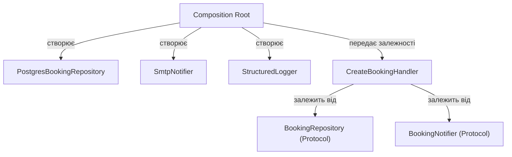

# Dependency Injection та Inversion of Control

## Зміст

- [Вступ](#вступ)
- [Проблема: жорсткі залежності](#проблема-жорсткі-залежності)
- [Inversion of Control (IoC)](#inversion-of-control-ioc)
- [Dependency Injection (DI)](#dependency-injection-di)
- [Способи інжекції](#способи-інжекції)
- [Composition Root](#composition-root)
- [DI-контейнер](#di-контейнер)
- [DI у тестуванні](#di-у-тестуванні)
- [Зв'язок із DIP](#звязок-із-dip)
- [Антипатерни](#антипатерни)
- [Поширені міфи](#поширені-міфи)
- [Джерела](#джерела)

---

## Вступ

[DIP](solid.md) каже: залежи від абстракцій, а не від деталей. `CreateBookingHandler` приймає `BookingRepository` (Protocol), а не `PostgresBookingRepository`. Добре. Але хтось має створити `PostgresBookingRepository` і передати його в handler. Хто? Де? Як?

Якщо handler сам створює свої залежності — він знову прив'язаний до конкретних реалізацій. Якщо кожен клас знає, як зібрати своє дерево залежностей — код перетворюється на павутину `new` / конструкторів, розкидану по всій системі.

**Dependency Injection** — це техніка, яка вирішує цю проблему: залежності не створюються всередині класу, а **передаються ззовні**. А **Inversion of Control** — це ширший принцип, окремим випадком якого є DI.

---

## Проблема: жорсткі залежності

```python
class CreateBookingHandler:
    def __init__(self):
        self._repo = PostgresBookingRepository(
            session=SessionFactory.create()
        )
        self._notifier = SmtpNotifier(
            host="smtp.example.com",
            port=587,
        )
        self._logger = FileLogger("/var/log/bookings.log")

    def handle(self, command: CreateBookingCommand) -> str:
        booking = Booking.create(command.user_id, command.resource_id, command.time_slot)
        self._repo.save(booking)
        self._notifier.notify(booking)
        self._logger.log(f"Booking {booking.id} created")
        return booking.id
```

Проблеми:

1. **Неможливо тестувати** — handler створює реальний Postgres-з'єднання, SMTP-клієнт і файловий логер. Unit-тест вимагає запущену інфраструктуру
2. **Неможливо замінити реалізацію** — перехід з SMTP на SendGrid означає зміну handler, хоча бізнес-логіка не змінилась
3. **Дублювання конфігурації** — кожен handler, який потребує `PostgresBookingRepository`, повторює логіку створення сесії
4. **Порушення [SRP](solid.md)** — handler відповідає і за бізнес-логіку, і за створення своїх залежностей

---

## Inversion of Control (IoC)

IoC — це загальний принцип, при якому **контроль над потоком виконання** передається від прикладного коду до фреймворку або зовнішнього механізму.

Без IoC ваш код викликає бібліотеку:

```python
result = library.do_something(data)
```

З IoC фреймворк викликає ваш код:

```python
@app.route("/bookings", methods=["POST"])
def create_booking():
    ...
```

Ви не контролюєте, коли `create_booking` буде викликано. Фреймворк вирішує сам — це і є «інверсія контролю». Martin Fowler назвав це **Hollywood Principle**: «Don't call us, we'll call you.»

IoC проявляється в різних формах:
- **Callback/Event handlers** — ви реєструєте обробник, фреймворк його викликає
- **Template Method** — базовий клас викликає ваші перевизначені методи
- **Dependency Injection** — фреймворк або зовнішній код збирає об'єкти та передає їм залежності

DI — це **конкретний механізм** IoC, який стосується управління залежностями між об'єктами.

---

## Dependency Injection (DI)

DI — це техніка, при якій залежності об'єкта **передаються ззовні**, а не створюються всередині:

```python
class CreateBookingHandler:
    def __init__(
        self,
        repo: BookingRepository,
        notifier: BookingNotifier,
        logger: Logger,
    ):
        self._repo = repo
        self._notifier = notifier
        self._logger = logger

    def handle(self, command: CreateBookingCommand) -> str:
        booking = Booking.create(command.user_id, command.resource_id, command.time_slot)
        self._repo.save(booking)
        self._notifier.notify(booking)
        self._logger.log(f"Booking {booking.id} created")
        return booking.id
```

Handler не знає, що `repo` — це Postgres, `notifier` — це SMTP, а `logger` — це файл. Він працює з абстракціями. Хто створить конкретні реалізації і передасть їх — вирішується **в іншому місці**.

---

## Способи інжекції

### Constructor Injection (рекомендований)

Залежності передаються через конструктор:

```python
class CreateBookingHandler:
    def __init__(self, repo: BookingRepository, notifier: BookingNotifier):
        self._repo = repo
        self._notifier = notifier
```

Переваги:
- Залежності явні — видно з сигнатури конструктора
- Об'єкт завжди в валідному стані — неможливо створити handler без залежностей
- Іммутабельність — залежності встановлюються один раз

Це основний і найпоширеніший спосіб. У більшості випадків достатньо лише його.

### Method Injection

Залежність передається в конкретний метод, коли вона потрібна лише для одного виклику:

```python
class ReportGenerator:
    def generate(self, data: ReportData, formatter: ReportFormatter) -> str:
        return formatter.format(data)
```

Підходить, коли залежність варіюється від виклику до виклику, а не є частиною стану об'єкта.

### Property Injection (не рекомендований)

Залежність встановлюється через атрибут після створення об'єкта:

```python
handler = CreateBookingHandler()
handler.repo = PostgresBookingRepository()  # можна забути
handler.notifier = SmtpNotifier()           # можна забути
```

Проблема: об'єкт може опинитися в невалідному стані (залежність не встановлена). Використовується рідко — лише коли constructor injection неможливий (наприклад, через обмеження фреймворку).

---

## Composition Root

Якщо об'єкти не створюють залежності самі — хтось має зібрати все дерево залежностей. Це місце називається **Composition Root** — єдина точка, де конкретні реалізації зв'язуються з абстракціями.

```python
# composition_root.py
def create_app() -> FastAPI:
    app = FastAPI()

    db_session = create_session("postgresql://...")
    repo = PostgresBookingRepository(db_session)
    notifier = SmtpNotifier(host="smtp.example.com", port=587)
    logger = StructuredLogger()

    create_handler = CreateBookingHandler(repo, notifier, logger)
    cancel_handler = CancelBookingHandler(repo, notifier, logger)

    app.include_router(create_booking_router(create_handler))
    app.include_router(cancel_booking_router(cancel_handler))

    return app
```

Composition Root:
- Живе **на межі системи** — точка входу (main, create_app, startup)
- Це **єдине місце**, де імпортуються конкретні реалізації
- Решта коду працює лише з абстракціями
- Відповідає за **wiring** — зв'язування інтерфейсів із реалізаціями



---

## DI-контейнер

Для маленького проєкту ручний wiring у Composition Root — достатньо. Але коли залежностей стає багато і з'являються вкладені дерева — ручне збирання стає громіздким:

```python
repo = PostgresBookingRepository(create_session("postgresql://..."))
validator = BookingValidator()
availability_checker = SlotAvailabilityChecker(repo)
factory = BookingFactory(validator, availability_checker)
notifier = SmtpNotifier("smtp.example.com", 587)
logger = StructuredLogger()
event_bus = InMemoryEventBus()
create_handler = CreateBookingHandler(repo, factory, notifier, logger, event_bus)
cancel_handler = CancelBookingHandler(repo, notifier, logger, event_bus)
reschedule_handler = RescheduleBookingHandler(repo, factory, availability_checker, logger, event_bus)
# ... і так для кожного handler
```

**DI-контейнер** автоматизує цей процес. Ви реєструєте, яка реалізація відповідає якому інтерфейсу, і контейнер сам збирає дерево:

```python
from dependency_injector import containers, providers

class Container(containers.DeclarativeContainer):
    config = providers.Configuration()

    db_session = providers.Singleton(create_session, config.db_url)

    booking_repo = providers.Factory(
        PostgresBookingRepository,
        session=db_session,
    )

    notifier = providers.Singleton(
        SmtpNotifier,
        host=config.smtp_host,
        port=config.smtp_port,
    )

    create_booking_handler = providers.Factory(
        CreateBookingHandler,
        repo=booking_repo,
        notifier=notifier,
    )
```

Контейнер бере на себе:
- **Резолюцію залежностей** — автоматично створює об'єкти та їхні залежності
- **Управління lifecycle** — Singleton (один екземпляр), Factory (новий на кожен запит), Scoped (один на scope, наприклад, на HTTP-запит)
- **Конфігурацію** — підставляє значення з конфігу

### Контейнер — не обов'язковий

DI-контейнер — це інструмент зручності, а не вимога. DI як патерн працює і без контейнера. Для проєкту з 10-20 класами ручний wiring цілком прийнятний і навіть переважний — він простіший і прозоріший.

---

## DI у тестуванні

DI робить тестування тривіальним: замість реальних залежностей передаєте тестові реалізації.

```python
class InMemoryBookingRepository:
    def __init__(self):
        self._storage: dict[str, Booking] = {}

    def save(self, booking: Booking) -> None:
        self._storage[booking.id] = booking

    def find_by_id(self, booking_id: str) -> Booking | None:
        return self._storage.get(booking_id)


class FakeNotifier:
    def __init__(self):
        self.sent: list[Booking] = []

    def notify(self, booking: Booking) -> None:
        self.sent.append(booking)


def test_create_booking():
    repo = InMemoryBookingRepository()
    notifier = FakeNotifier()
    logger = NullLogger()

    handler = CreateBookingHandler(repo, notifier, logger)
    booking_id = handler.handle(CreateBookingCommand(
        user_id="u1",
        resource_id="r1",
        time_slot=TimeSlot(start, end),
    ))

    assert repo.find_by_id(booking_id) is not None
    assert len(notifier.sent) == 1
```

Жодного Postgres, SMTP, файлів. Тест працює за мілісекунди і перевіряє саме бізнес-логіку.

---

## Зв'язок із DIP

DI і [DIP](solid.md) — різні речі, які часто плутають:

| | DIP (принцип) | DI (техніка) |
|---|---|---|
| Що це | Принцип проєктування: залежи від абстракцій | Техніка: передавай залежності ззовні |
| Відповідає на | **Від чого** залежити? | **Як** отримати залежність? |
| Без чого працює | Можна дотримуватись DIP без DI (Service Locator) | Можна використовувати DI без DIP (інжектити конкретні класи) |

DIP визначає **напрямок залежностей**: домен визначає інтерфейси, інфраструктура реалізує. DI визначає **спосіб доставки**: залежності передаються ззовні, а не створюються всередині.

На практиці вони працюють разом:
- DIP каже: `CreateBookingHandler` залежить від `BookingRepository` (Protocol), а не від `PostgresBookingRepository`
- DI каже: `PostgresBookingRepository` створюється зовні і передається в конструктор handler

Одне без іншого має менше сенсу. DIP без DI — інтерфейс є, але клас сам створює реалізацію. DI без DIP — залежність передається ззовні, але це конкретний клас, а не абстракція.

---

## Антипатерни

| Антипатерн | Опис | Як виправити |
|------------|------|--------------|
| Service Locator | Клас сам запитує залежності у глобального контейнера: `repo = container.resolve(BookingRepository)` | Передавати залежності через конструктор |
| Bastard Injection | Конструктор з default-реалізацією: `def __init__(self, repo=PostgresBookingRepository())` | Зробити залежність обов'язковою, без default |
| Контейнер скрізь | `Container` імпортується в domain або application шар | Контейнер живе лише в Composition Root |
| Інжекція конкретних класів | `def __init__(self, repo: PostgresBookingRepository)` | Залежити від абстракції (Protocol/ABC) |
| God Composition Root | Composition Root на 500 рядків з бізнес-логікою | Тільки wiring, ніякої логіки; розбити на модульні фабрики |

### Service Locator — чому це проблема

```python
class CreateBookingHandler:
    def handle(self, command: CreateBookingCommand) -> str:
        repo = ServiceLocator.get(BookingRepository)  # приховує залежність
        booking = Booking.create(...)
        repo.save(booking)
```

Залежність **прихована** — з сигнатури конструктора не видно, що handler потребує `BookingRepository`. Це ускладнює тестування (потрібно конфігурувати глобальний локатор) і розуміння коду (не зрозуміло, від чого залежить клас, поки не прочитаєш тіло методу).

---

## Поширені міфи

### «DI — це обов'язково контейнер»

DI — це **патерн**, а не бібліотека. Передати залежність через конструктор — це вже DI. Контейнер лише автоматизує wiring, коли дерево залежностей стає великим. Для невеликого проєкту ручний wiring у Composition Root — простіший і прозоріший варіант.

### «IoC = DI»

IoC — це загальний принцип інверсії потоку керування. DI — один із проявів IoC. Фреймворк, який викликає ваші контролери — це IoC. Event handler, який реагує на подію — це IoC. DI — це IoC стосовно **створення і передачі залежностей**.

### «DI ускладнює код»

DI робить залежності **явними**. Без DI залежності все одно існують — вони просто приховані всередині конструкторів у вигляді `new` / прямих імпортів. DI не додає залежностей — він їх проявляє. Якщо конструктор приймає 8 параметрів — проблема не в DI, а в тому, що клас має забагато залежностей ([SRP](solid.md)).

### «DI потрібен лише для тестування»

Тестування — очевидна перевага, але не єдина. DI забезпечує:
- **Конфігурованість** — різні реалізації для різних середовищ (dev/staging/prod)
- **Модульність** — заміна компонента без зміни коду, що його використовує
- **Прозорість** — залежності видно з конструктора, не потрібно читати тіло класу

### «Service Locator — це теж DI»

Service Locator — це **антипатерн** відносно DI. У DI залежності передаються ззовні і видні з конструктора. У Service Locator клас сам звертається до глобального реєстру — залежності приховані. Martin Fowler виділяє їх як два різних патерни, і рекомендує DI як переважний варіант.

### «У Python DI не потрібен, бо є duck typing»

Duck typing вирішує питання **типізації** (не потрібен explicit interface, щоб передати об'єкт). DI вирішує питання **створення та передачі залежностей**. Це різні проблеми. `Protocol` у Python дає structural typing (можна не наслідуватись від ABC), але залежності все одно потрібно передавати ззовні, а не створювати всередині класу.

---

## Джерела

- **Martin Fowler** — [Inversion of Control Containers and the Dependency Injection pattern](https://martinfowler.com/articles/injection.html) (2004) — стаття, де Fowler формалізував DI як патерн і відокремив його від Service Locator
- **Robert C. Martin** — *Clean Architecture: A Craftsman's Guide to Software Structure and Design* (2017) — DIP як архітектурний принцип, зв'язок із DI
- **Mark Seemann** — *Dependency Injection in .NET* (2011, 2nd ed. 2019) — найбільш ґрунтовна книга про DI: Composition Root, Pure DI, антипатерни, DI-контейнери
- **Steven van Deursen, Mark Seemann** — *Dependency Injection: Principles, Practices, and Patterns* (2019) — оновлене видання з фокусом на принципи, а не конкретну платформу
