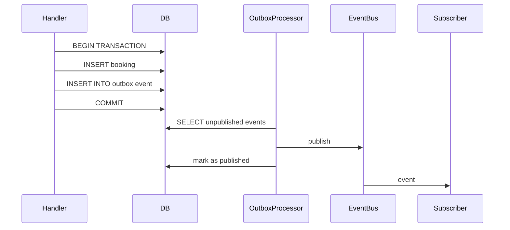

# Integration Events

## Зміст

- [Вступ](#вступ)
- [Що таке Integration Event](#що-таке-integration-event)
- [Проєктування подій](#проєктування-подій)
- [Хто публікує події](#хто-публікує-події)
- [Event Bus: реалізація доставки](#event-bus-реалізація-доставки)
- [Eventual Consistency](#eventual-consistency)
- [Outbox Pattern: надійна доставка](#outbox-pattern-надійна-доставка)
- [Ідемпотентність обробників](#ідемпотентність-обробників)
- [Поширені міфи](#поширені-міфи)
- [Джерела](#джерела)

---

## Вступ

Бронювання створено. Що далі? Потрібно надіслати email. Оновити аналітику. Записати в аудит. Три побічні ефекти. Хто їх ініціює?

Якщо handler викликає кожен компонент напряму — він знає про все: notification, analytics, audit. Додаєте четвертий ефект — лізете в handler. П'ятий — знову handler. Він обростає залежностями і стає центром, через який проходить все. Це та [синхронна зв'язаність](communication-patterns.md#coupling-звязаність-через-комунікацію), від якої хочеться позбутися.

Integration Event — це спосіб сказати: «щось відбулося», не вказуючи, кому це цікаво. Handler публікує факт. Хто реагує — не його справа.

---

## Що таке Integration Event

Integration Event — це повідомлення про **значущий бізнес-факт**, яке публікується для інших модулів або сервісів. Це **контракт між bounded contexts** — публічний API у вигляді події.

```python
@dataclass(frozen=True)
class BookingCreated:
    booking_id: str
    user_id: str
    resource_id: str
    start_time: datetime
    end_time: datetime
    occurred_at: datetime
```

Ключові характеристики:

| Характеристика | Опис |
|---------------|------|
| **Незмінна (immutable)** | Подія — факт, що вже стався. Факти не змінюються |
| **Іменується в минулому часі** | `BookingCreated`, `BookingCancelled`, `PaymentProcessed` — не `CreateBooking` |
| **Містить достатньо контексту** | Підписник має всю інформацію для обробки, без додаткових запитів |
| **Публічний контракт** | Змінювати обережно — підписники в інших модулях залежать від структури |

---

## Проєктування подій

### Проблема: недостатньо контексту

```python
@dataclass(frozen=True)
class BookingCreated:
    booking_id: str  # і все
```

Підписник отримує ID. Щоб надіслати email — потрібен user_id. Щоб оновити аналітику — потрібен resource_id і час. Доводиться йти в Repository за деталями. Підписник залежить від чужого модуля.

### Рішення: подія як самодостатній факт

```python
@dataclass(frozen=True)
class BookingCreated:
    booking_id: str
    user_id: str
    resource_id: str
    start_time: datetime
    end_time: datetime
    occurred_at: datetime
```

Підписник має все, що потрібно. Не робить додаткових запитів. Не залежить від [репозиторію](repository.md) іншого модуля.

### Скільки даних вкладати?

Правило: достатньо, щоб **відомі підписники** могли обробити подію без зворотних запитів. Не потрібно дублювати весь агрегат — тільки те, що має бізнес-значення для реакції. Пам'ятайте: це публічний контракт, кожне поле — зобов'язання.

### Іменування

Подія описує **бізнес-факт**, а не технічну операцію:

| Погано | Добре | Чому |
|--------|-------|------|
| `BookingInserted` | `BookingCreated` | Не технічна операція, а бізнес-факт |
| `StatusChanged` | `BookingCancelled` | Конкретний бізнес-зміст, не generic |
| `SendNotification` | `BookingConfirmed` | Подія — факт, не команда |
| `BookingEvent` | `BookingCreated` | Одна подія = один конкретний факт |

---

## Хто публікує події

Application Layer (Command Handler) публікує подію після успішного збереження:

```python
class CreateBookingCommandHandler:
    def __init__(self, factory: BookingFactory,
                 repo: BookingRepository, event_bus: EventBus):
        self._factory = factory
        self._repo = repo
        self._event_bus = event_bus

    def handle(self, command: CreateBookingCommand) -> str:
        booking = self._factory.create(...)
        self._repo.save(booking)
        self._event_bus.publish(BookingCreated(
            booking_id=booking.id,
            user_id=booking.user_id,
            resource_id=booking.resource_id,
            start_time=booking.time_slot.start,
            end_time=booking.time_slot.end,
            occurred_at=datetime.utcnow(),
        ))
        return booking.id
```

Handler контролює, коли саме публікується подія — після успішного збереження, не раніше.

---

## Event Bus: реалізація доставки

### In-Process Event Bus (для моноліту)

Простий диспетчер подій усередині одного процесу:

```python
class EventBus:
    def __init__(self):
        self._handlers: dict[type, list[Callable]] = {}

    def subscribe(self, event_type: type, handler: Callable) -> None:
        self._handlers.setdefault(event_type, []).append(handler)

    def publish(self, event) -> None:
        for handler in self._handlers.get(type(event), []):
            handler(event)
```

```python
event_bus.subscribe(BookingCreated, notification_handler.on_booking_created)
event_bus.subscribe(BookingCreated, analytics_handler.on_booking_created)
event_bus.subscribe(BookingCancelled, billing_handler.on_booking_cancelled)
```

Не потребує зовнішньої інфраструктури. Підписники викликаються в тому ж процесі. Для [модульного моноліту](modular-monolith.md) — найпростіший старт.

### Message Broker (для розподілених систем)

Зовнішній компонент (RabbitMQ, Kafka, Redis Streams), який персистить повідомлення і доставляє підписникам. Потрібен, коли компоненти — окремі процеси або потрібні гарантії доставки. Детальніше про вибір — в [патернах комунікації](communication-patterns.md).

---

## Eventual Consistency

### Проблема

При синхронній комунікації всі зміни відбуваються в одній транзакції — після коміту система одразу консистентна. При асинхронній — основна операція комітується, а побічні ефекти ще не оброблені. Система **тимчасово неконсистентна**.

### Strong vs Eventual

**Strong Consistency**: після запису всі читачі одразу бачать оновлені дані. Гарантується транзакцією в одній БД.

**Eventual Consistency**: після запису дані **стануть** консистентними через деякий час. Підписники обробляють події із затримкою.

### Приклад

1. Бронювання створено → запис у БД (strong — в межах одного модуля)
2. Публікується подія `BookingCreated`
3. Notification отримує подію через 50мс → email надіслано
4. Analytics отримує подію через 100мс → статистика оновлена

Між кроками 2 і 4 аналітика ще не знає про нове бронювання. Це **нормально і by design**.

### Де яка консистентність?

| Сценарій | Тип | Чому |
|----------|-----|------|
| Перевірка доступності слоту перед створенням бронювання | Strong | Потрібна точна інформація, інакше — подвійне бронювання |
| Надсилання email після створення | Eventual | Затримка в секунди прийнятна |
| Оновлення аналітики | Eventual | Не впливає на бізнес-операцію |
| Списання коштів | Залежить від вимог | Критична операція, можливо потрібна saga |

Правило: **в межах одного [агрегату](entities-and-aggregates.md)** — strong consistency (одна транзакція). **Між модулями / агрегатами** — eventual consistency (через події).

---

## Outbox Pattern: надійна доставка

### Проблема

```python
self._repo.save(booking)           # 1. зберегли в БД
self._event_bus.publish(event)     # 2. опублікували подію
```

Що якщо крок 1 пройшов, а крок 2 — ні (процес впав, мережа відвалилась)? Бронювання в БД, а подія — втрачена. Підписники ніколи не дізнаються.

### Рішення

Outbox Pattern: зберігаємо і дані, і подію **в одній транзакції**. Окремий процес читає таблицю outbox і публікує події:



Подія гарантовано збережена в БД разом з основними даними. Навіть якщо процес впаде після коміту — `OutboxProcessor` підхопить подію при наступному запуску.

### Спрощений варіант для моноліту

Для in-process Event Bus з однією БД достатньо публікувати подію **після успішного коміту транзакції**. Повноцінний Outbox з окремою таблицею потрібен, коли подія передається через зовнішній брокер і має пережити збій процесу.

---

## Ідемпотентність обробників

### Проблема

Подія може бути доставлена **більше одного разу** (at-least-once delivery). Причини: retry після timeout, перезапуск Outbox Processor, дублікат у черзі. Якщо обробник не ідемпотентний — один email перетворюється на три.

### Рішення

Обробник перевіряє, чи вже оброблялася ця подія:

```python
class NotificationHandler:
    def __init__(self, notification_repo: NotificationRepository):
        self._repo = notification_repo

    def on_booking_created(self, event: BookingCreated) -> None:
        if self._repo.already_processed(event.booking_id, "confirmation"):
            return
        self._send_confirmation(event)
        self._repo.mark_processed(event.booking_id, "confirmation")
```

Стратегії ідемпотентності:
- **Deduplication за ID події**: зберігаємо event_id в таблицю оброблених, перевіряємо перед обробкою
- **Природна ідемпотентність**: якщо `UPDATE stats SET count = count + 1` — не ідемпотентно. Якщо `UPSERT stats SET count = (SELECT COUNT(*) FROM bookings)` — ідемпотентно
- **Idempotency key**: унікальний ключ операції, що запобігає повторному виконанню

---

## Поширені міфи

### «Integration Event — це те саме, що повідомлення в черзі»

Ні. Integration Event — це **бізнес-факт**. Повідомлення в черзі — **механізм доставки**. Подія може бути доставлена через in-process виклик, через Event Bus, через message broker — це деталь реалізації.

### «Події потрібні тільки для мікросервісів»

Ні. Події вирішують проблему зв'язаності між компонентами. Ця проблема є і в моноліті — коли один модуль хоче реагувати на дії іншого, не залежачи від нього напряму. In-process Event Bus в моноліті — десяток рядків коду.

### «Eventual consistency — це баг, який потрібно виправити»

Це не баг, а **архітектурне рішення**. Ви свідомо обмінюєте негайну консистентність на слабку зв'язаність і відмовостійкість. Для більшості побічних ефектів (email, аналітика, аудит) це виграшна угода.

### «Подія повинна містити мінімум даних — тільки ID»

Тоді підписник змушений запитувати деталі у відправника — і знову з'являється зв'язаність. Подія має містити достатньо контексту для обробки. Не весь агрегат, але достатньо для відомих підписників.

### «Кожна зміна стану має генерувати подію»

Ні. Подія — це **значущий бізнес-факт**. Зміна email — можливо. Оновлення `updated_at` — точно ні. Публікуйте події тоді, коли інші компоненти мають на це реагувати.

### «Outbox Pattern потрібен завжди»

Для in-process Event Bus у моноліті з однією БД — зазвичай ні. Публікація після коміту транзакції достатньо надійна. Outbox стає потрібним, коли подія передається через зовнішній брокер і має пережити збій процесу.

---

## Джерела

- **Eric Evans** — *Domain-Driven Design* (2003) — доменні події як тактичний патерн DDD
- **Vaughn Vernon** — *Implementing Domain-Driven Design* (2013) — практична реалізація подій, розділення Domain Events та Integration Events (Chapter 8)
- **Gregor Hohpe, Bobby Woolf** — *Enterprise Integration Patterns* (2003) — патерни обміну повідомленнями, на яких базується Event Bus
- **Chris Richardson** — [Transactional Outbox](https://microservices.io/patterns/data/transactional-outbox.html) — опис Outbox Pattern
