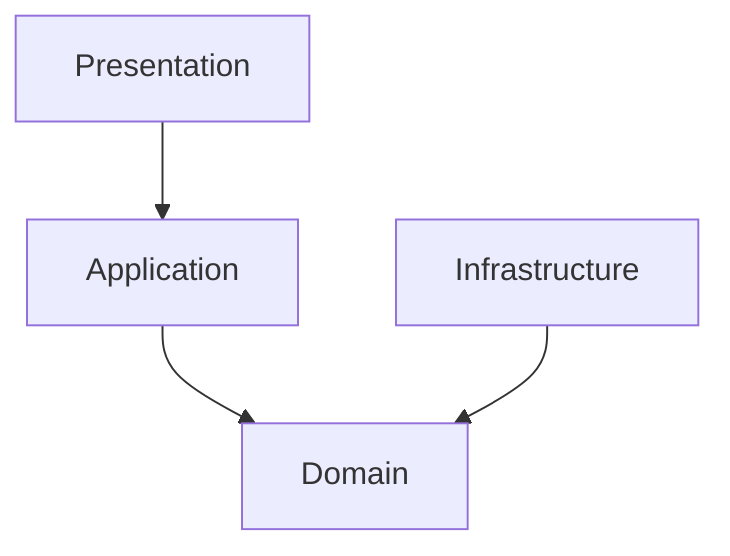
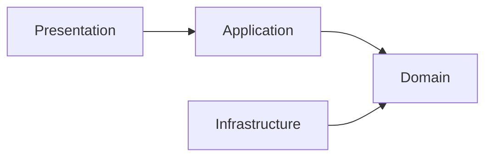
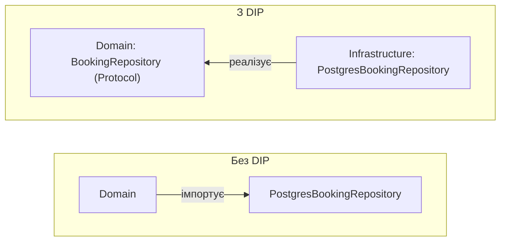

# Шарова архітектура

## Зміст

- [Вступ](#вступ)
- [Проблема: код без структури](#проблема-код-без-структури)
- [Layered Architecture за Eric Evans](#layered-architecture-за-eric-evans)
- [Чотири шари](#чотири-шари)
- [Напрямок залежностей](#напрямок-залежностей)
- [DIP як механізм інверсії](#dip-як-механізм-інверсії)
- [Зв'язок із Clean Architecture](#звязок-із-clean-architecture)
- [Антипатерни](#антипатерни)
- [Поширені міфи](#поширені-міфи)
- [Джерела](#джерела)

---

## Вступ

Контролер приймає запит, дістає дані з БД, перевіряє бізнес-правило, зберігає результат, повертає відповідь. Все в одному файлі, все працює. Потім потрібно змінити БД — і SQL-запити розкидані по всьому проєкту. Потім потрібно покрити бізнес-логіку unit-тестами — і виявляється, що тест не запуститься без піднятої бази.

Рішення звучить просто: **розділити код на шари**. Але «шарова архітектура» — це розмите поняття. Різні автори вкладають у нього різний зміст, і без уточнення це мало що означає.

У цьому документі ми розглядаємо конкретне визначення — **Layered Architecture** із книги Eric Evans *Domain-Driven Design* (2003): чотири шари, чіткий поділ відповідальностей, і **залежності, направлені до домену**.

---

## Проблема: код без структури

Уявімо систему бронювання. Спочатку все просто: контролер обробляє запит, перевіряє дані, звертається до БД, повертає відповідь.

```python
@app.post("/bookings")
def create_booking(data: dict):
    if data["start"] >= data["end"]:
        raise HTTPException(400, "Некоректний діапазон")

    existing = db.execute(
        "SELECT * FROM bookings WHERE resource_id = :rid AND start < :end AND end > :start",
        {"rid": data["resource_id"], "start": data["start"], "end": data["end"]},
    )
    if existing.fetchone():
        raise HTTPException(409, "Слот зайнятий")

    db.execute(
        "INSERT INTO bookings (user_id, resource_id, start, end, status) VALUES (:uid, :rid, :s, :e, 'created')",
        {"uid": data["user_id"], "rid": data["resource_id"], "s": data["start"], "e": data["end"]},
    )
    db.commit()
    return {"status": "created"}
```

Проблеми:

1. **Бізнес-логіка змішана з інфраструктурою** — правило «слот не повинен перетинатися» живе поруч із SQL-запитами і HTTP-кодами
2. **Неможливо тестувати логіку окремо** — щоб перевірити бізнес-правило, потрібна БД і HTTP-фреймворк
3. **Зміна БД ламає все** — SQL розкидано по контролерах, перехід на іншу БД = переписування бізнес-логіки
4. **Дублювання** — та сама перевірка перетину слотів з'являється в кількох ендпоінтах

---

## Layered Architecture за Eric Evans

У книзі *Domain-Driven Design* (2003) Eric Evans описує **Layered Architecture** — архітектурний патерн із чотирма шарами:



Ключова ідея: **залежності направлені до домену**. Domain Layer — ядро системи, яке не залежить від жодного іншого шару. Application залежить від Domain. Presentation залежить від Application. Infrastructure залежить від Domain (реалізує його інтерфейси), а не навпаки.

Це принципово відрізняється від наївного підходу, де бізнес-логіка залежить від бази даних.

Evans сформулював це так:

> *«Partition a complex program into layers. Develop a design within each layer that is cohesive and that depends only on the layers below.»*
> — Eric Evans, *Domain-Driven Design*, Chapter 4

При цьому «below» у контексті Evans означає **ближче до ядра** — до Domain Layer.

---

## Чотири шари

### Presentation Layer

**Відповідальність**: взаємодія із зовнішнім світом — прийом HTTP-запитів, серіалізація/десеріалізація, валідація формату.

Містить:
- Контролери / API endpoints
- [DTO](dto.md) — об'єкти для передачі даних між клієнтом і сервером
- Маппінг HTTP-запитів → команди/запити Application Layer

**Не містить**: бізнес-логіки, прямих звернень до БД.

### Application Layer

**Відповідальність**: оркестрація — координує виконання бізнес-операцій, викликаючи домен та інфраструктуру через інтерфейси.

Містить:
- Use Cases / Application Services — по одному на бізнес-операцію
- Управління [транзакціями](orm.md) через абстракції

**Не містить**: бізнес-правил (вони в домені), деталей реалізації (вони в інфраструктурі).

### Domain Layer

**Відповідальність**: бізнес-логіка у чистому вигляді — правила, інваріанти, доменні моделі.

Містить:
- Доменні моделі ([Entities, Aggregates](entities-and-aggregates.md), [Value Objects](value-objects.md))
- Бізнес-правила та інваріанти
- Інтерфейси [репозиторіїв](repository.md) — визначає **що** потрібно, але не **як**

**Не містить**: залежностей від фреймворків, [ORM](orm.md), HTTP, баз даних. Це найчистіший шар — **ядро системи**.

### Infrastructure Layer

**Відповідальність**: технічна реалізація — робота з БД, зовнішніми API, файловою системою.

Містить:
- Реалізації репозиторіїв (імплементації інтерфейсів із Domain Layer)
- ORM-моделі
- Клієнти зовнішніх сервісів
- [Маппінг](orm.md) між доменними моделями та моделями БД

**Не містить**: бізнес-логіки.

---

## Напрямок залежностей



- Presentation залежить від Application
- Application залежить від Domain
- Infrastructure залежить від Domain (реалізує його інтерфейси)
- **Domain не залежить ні від кого**

Саме цей напрямок відрізняє Layered Architecture Evans від наївного підходу, де бізнес-логіка імпортує конкретні репозиторії з прив'язкою до ORM або SQL.

### Приклад: наївний підхід (домен залежить від інфраструктури)

```python
# business_logic/booking_service.py
from data_access.booking_repository import BookingRepository  # конкретна реалізація з SQLAlchemy

class BookingService:
    def __init__(self, repo: BookingRepository):
        self._repo = repo

    def create_booking(self, user_id: int, resource_id: int, start: datetime, end: datetime):
        if start >= end:
            raise ValueError("Початок має бути раніше за кінець")
        booking = BookingModel(user_id=user_id, resource_id=resource_id, start=start, end=end)
        self._repo.save(booking)
        return booking
```

`BookingService` **імпортує** конкретний `BookingRepository`. Бізнес-логіка знає про SQLAlchemy. Щоб змінити БД або написати unit-тест — потрібно змінювати бізнес-шар.

### Приклад: Layered Architecture Evans (домен ні від кого не залежить)

Домен **визначає інтерфейс** (що мені потрібно):

```python
# domain/repositories.py
from typing import Protocol

class BookingRepository(Protocol):
    def save(self, booking: Booking) -> None: ...
    def find_by_id(self, booking_id: str) -> Booking | None: ...
```

Інфраструктура **реалізує інтерфейс** (як це зробити):

```python
# infrastructure/postgres_booking_repo.py
from domain.repositories import BookingRepository

class PostgresBookingRepository:
    def save(self, booking: Booking) -> None:
        # SQL / ORM
        ...

    def find_by_id(self, booking_id: str) -> Booking | None:
        # SQL / ORM
        ...
```

Application Layer **залежить від абстракції**:

```python
# application/create_booking.py
from domain.repositories import BookingRepository

class CreateBookingUseCase:
    def __init__(self, repo: BookingRepository):
        self._repo = repo
```

Тепер:
- Домен не знає про Postgres, SQLAlchemy, або будь-яку БД
- У тестах — `InMemoryBookingRepository`
- У продакшені — `PostgresBookingRepository`
- Зміна БД = нова реалізація інтерфейсу, без змін у домені та Application Layer

---

## DIP як механізм інверсії

Як саме Infrastructure залежить від Domain, а не навпаки? Через **Dependency Inversion Principle** — один із [принципів SOLID](solid.md):

> Модулі верхнього рівня не повинні залежати від модулів нижнього рівня. Обидва мають залежати від абстракцій.

У контексті Layered Architecture:
- **Domain** (верхній рівень) визначає інтерфейс `BookingRepository`
- **Infrastructure** (нижній рівень) реалізує його як `PostgresBookingRepository`
- Напрямок залежності: `Infrastructure → Domain` (інфраструктура імпортує інтерфейс із домену)

Без DIP напрямок був би зворотнім: `Domain → Infrastructure` (домен імпортує конкретну реалізацію). Це робить бізнес-логіку заручницею технічних деталей.



Інтерфейс `BookingRepository` визначається **в домені** — саме домен диктує, що йому потрібно. Інфраструктура лише виконує цей контракт. Якщо інтерфейс живе в пакеті `infrastructure` — DIP порушено, навіть якщо інтерфейс формально існує.

---

## Зв'язок із Clean Architecture

У 2012 році Robert C. Martin описав [Clean Architecture](https://blog.cleancoder.com/uncle-bob/2012/08/13/the-clean-architecture.html) і сформулював **Dependency Rule**:

> *Source code dependencies must point only inward, toward higher-level policies.*

Це та сама ідея, що й у Evans: залежності направлені до центру (до домену). Clean Architecture узагальнює підхід, раніше описаний під іншими назвами:

- **Hexagonal Architecture** (Alistair Cockburn, 2005) — акцент на портах і адаптерах: домен спілкується із зовнішнім світом через порти (інтерфейси), які реалізуються адаптерами
- **Onion Architecture** (Jeffrey Palermo, 2008) — акцент на концентричних колах: домен у центрі, залежності йдуть ззовні до центру

Усі ці підходи — **різні формулювання одного принципу**: бізнес-логіка (домен) не залежить від технічних деталей, а технічні деталі залежать від бізнес-логіки. Evans описав це в контексті DDD, Martin — як загальний архітектурний принцип, Cockburn — через метафору портів і адаптерів.

Для практичних цілей Layered Architecture (Evans), Clean Architecture (Martin), Hexagonal Architecture (Cockburn) та Onion Architecture (Palermo) — це один підхід з різною термінологією та акцентами.

---

## Антипатерни

| Антипатерн | Опис | Як виправити |
|------------|------|--------------|
| Домен імпортує ORM | `from sqlalchemy import Column` в доменній моделі | Створити окрему доменну модель, [маппити](orm.md) в інфраструктурі |
| Бізнес-логіка в контролері | Валідація слотів, перевірка прав у Presentation Layer | Перенести в Domain Layer або Use Case |
| Use Case робить все сам | Містить SQL, валідацію, маппінг, бізнес-логіку | Делегувати домену (логіка) та інфраструктурі (persistence) |
| Зворотна залежність | Infrastructure імпортує Application | Дотримуватись напрямку залежностей |
| «Шари» без інверсії | 4 папки, але домен імпортує інфраструктуру | Недостатньо розділити код на папки — потрібно інвертувати залежності через DIP |
| Інтерфейс в інфраструктурі | `BookingRepository` (Protocol) живе в `infrastructure/` | Інтерфейс має жити в `domain/` — домен диктує контракт |

---

## Поширені міфи

### «Шарова архітектура — це коли залежності йдуть зверху вниз»

Це одна з інтерпретацій, але не єдина. У наївному підході залежності дійсно йдуть зверху вниз: Presentation → Business Logic → Data Access. Але Layered Architecture в Evans має принципово інший напрямок: залежності направлені **до домену**, а не просто «вниз». Це фундаментальна різниця, яку легко пропустити.

### «Достатньо розкласти код по папкам — і це шарова архітектура»

Структура папок — це не архітектура. Можна мати папки `domain/`, `infrastructure/`, `application/` — і при цьому домен імпортує SQLAlchemy. Формально «шари» є, а правило залежностей порушено. Архітектура — це **правила залежностей**, а не файлова структура.

### «Шарова архітектура — це чітко визначений патерн»

«Шарова архітектура» — це **загальна ідея** розділення коду на горизонтальні рівні відповідальності. Різні автори вкладають у неї різний зміст:

- У класичній інтерпретації (наприклад, [POSA](https://en.wikipedia.org/wiki/Pattern-Oriented_Software_Architecture)) — залежності зверху вниз
- У Eric Evans (*Domain-Driven Design*, 2003) — чотири шари із залежностями до домену
- У Robert C. Martin (*Clean Architecture*, 2012) — Dependency Rule: залежності до центру

Коли хтось каже «у нас шарова архітектура» — завжди уточнюйте, як саме організовані залежності.

### «Це занадто складно для моноліту»

Інверсія залежностей додає складність: окремі доменні моделі, маппери, інтерфейси. Для простого CRUD з трьома ендпоінтами — це overkill. Але щойно з'являється нетривіальна бізнес-логіка (інваріанти, різні стратегії, складна валідація) — ізоляція домену починає окуповувати себе тим, що бізнес-логіку можна тестувати, змінювати і розуміти незалежно від інфраструктури.

### «DIP — це просто "створити інтерфейс"»

DIP — це не про наявність інтерфейсу. Це про **напрямок залежності**. Інтерфейс визначається тим, кому він потрібен (домену), а реалізується тим, хто може (інфраструктурою). Якщо інтерфейс `BookingRepository` живе в пакеті `infrastructure` — DIP порушено, навіть якщо інтерфейс є.

### «Hexagonal, Onion і Clean Architecture — це різні речі»

Концептуально — це один підхід із різних сторін:
- **Hexagonal** (Cockburn, 2005) — акцент на портах і адаптерах
- **Onion** (Palermo, 2008) — акцент на концентричних колах
- **Clean** (Martin, 2012) — узагальнення: Dependency Rule, Use Cases, Entities

Усі побудовані на одному принципі: **домен не залежить від технічних деталей**. Evans описав це ще в 2003 році в контексті DDD. Відрізняються термінологією і акцентами, але суть та сама.

### «В шаровій архітектурі обов'язково 4 шари»

Чотири шари (Presentation, Application, Domain, Infrastructure) — це типова, але не єдина конфігурація. Для маленького проєкту Application і Domain можна об'єднати. Головне — напрямок залежностей: зовнішні шари залежать від внутрішніх, а домен ні від кого не залежить.

---

## Джерела

- **Eric Evans** — *Domain-Driven Design: Tackling Complexity in the Heart of Software* (2003) — Chapter 4: Isolating the Domain, Layered Architecture як тактичний патерн DDD
- **Robert C. Martin** — *Clean Architecture: A Craftsman's Guide to Software Structure and Design* (2017) — Dependency Rule, формалізація ідеї «залежності до центру»
- **Robert C. Martin** — [The Clean Architecture](https://blog.cleancoder.com/uncle-bob/2012/08/13/the-clean-architecture.html) (2012) — оригінальна стаття
- **Alistair Cockburn** — [Hexagonal Architecture (Ports and Adapters)](https://alistair.cockburn.us/hexagonal-architecture/) (2005) — порти і адаптери, ізоляція домену від зовнішнього світу
- **Jeffrey Palermo** — [The Onion Architecture](https://jeffreypalermo.com/2008/07/the-onion-architecture-part-1/) (2008) — концентричні кола, домен у центрі
