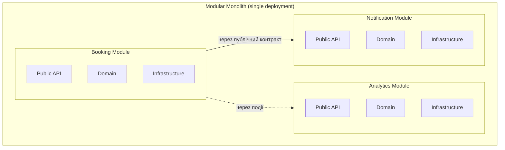
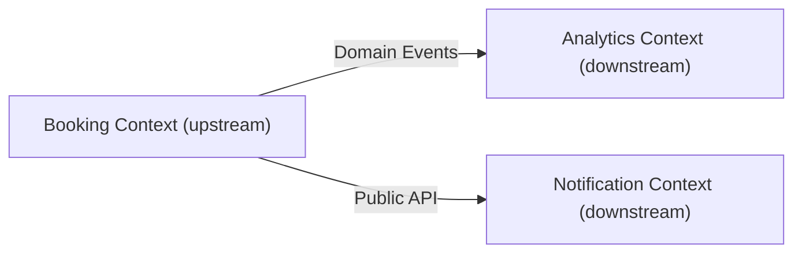
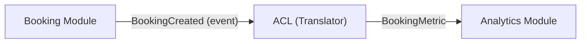

# Модульний моноліт та обмежені контексти

## Зміст

- [Вступ](#вступ)
- [Проблема: моноліт без меж](#проблема-моноліт-без-меж)
- [Модульний моноліт як рішення](#модульний-моноліт-як-рішення)
- [Bounded Context (обмежений контекст)](#bounded-context-обмежений-контекст)
- [Структура модуля](#структура-модуля)
- [Комунікація між модулями](#комунікація-між-модулями)
- [ACL (Anti-Corruption Layer)](#acl-anti-corruption-layer)
- [Класичний моноліт vs Модульний моноліт vs Мікросервіси](#класичний-моноліт-vs-модульний-моноліт-vs-мікросервіси)
- [Антипатерни](#антипатерни)
- [Поширені міфи](#поширені-міфи)
- [Джерела](#джерела)

---

## Вступ

Система бронювання працює. Є бронювання, є користувачі, є нотифікації, є аналітика. Все в одному проєкті. Потім хтось змінює модель `Booking` — і ламається відправка email. Хтось рефакторить нотифікації — і з'ясовується, що аналітика імпортувала внутрішній клас із `notification/domain/models.py`. Кожна зміна тягне за собою каскад.

Проблема не в тому, що це моноліт. Проблема в тому, що **між частинами системи немає меж**. Код «бронювання» знає про внутрішню структуру коду «нотифікацій», і навпаки. Це не архітектура — це один великий клубок.

Модульний моноліт — це спосіб провести чіткі межі **всередині** моноліту, не переходячи до мікросервісів.

---

## Проблема: моноліт без меж

Уявімо систему з кількома доменними областями: бронювання, користувачі, нотифікації, аналітика. В класичному моноліті вони живуть поруч і вільно звертаються одне до одного:

```python
# notification/send_confirmation.py
from booking.domain.models import Booking
from booking.domain.models import User

class SendConfirmationHandler:
    def handle(self, booking: Booking):
        email = booking.user.email
        self._send_email(email, f"Booking {booking.id} confirmed")
```

Notification **імпортує** внутрішні моделі Booking. Вони пов'язані на рівні коду, і ця зв'язаність — неявна.

### Чому це проблема?

**Каскадні зміни.** Зміна поля `User.email` на `User.contact_email` у модулі Booking ламає модуль Notification. Зміна структури `Booking` ламає аналітику. Кожен модуль знає про внутрішні деталі інших — і будь-яка зміна поширюється хвилями.

**Неможливість незалежної роботи.** Дві команди не можуть працювати паралельно, бо їхній код переплетений. Merge-конфлікти, зламані тести чужого модуля, неочікувані побічні ефекти.

**Розмита відповідальність.** Де живе логіка «надіслати email після бронювання»? В модулі бронювання? В модулі нотифікацій? Коли межі нечіткі — логіка опиняється «де зручніше», а не «де правильно».

**Складність розуміння.** Щоб зрозуміти, що відбувається при створенні бронювання, потрібно прочитати код у Booking, Notification, Analytics, Audit — і всюди є прямі імпорти з інших модулів.

---

## Модульний моноліт як рішення

Модульний моноліт (Modular Monolith) — це архітектурний підхід, при якому застосунок залишається **єдиним розгортуваним артефактом**, але внутрішньо розділений на **ізольовані модулі** з чіткими межами.



Ключові принципи:

1. **Кожен модуль має публічний контракт** — чітко визначений набір операцій, які він надає назовні
2. **Внутрішня структура модуля прихована** — інші модулі не мають доступу до внутрішніх моделей, репозиторіїв, інфраструктури
3. **Комунікація лише через контракти або події** — прямий імпорт внутрішніх класів іншого модуля заборонений
4. **Кожен модуль — свій bounded context** із власною моделлю предметної області

Модульний моноліт — це **проміжний крок** між класичним монолітом і мікросервісами. Він дає переваги чіткого розділення без складності розподіленої системи.

---

## Bounded Context (обмежений контекст)

Концепція з Domain-Driven Design (Eric Evans, 2003). Bounded Context — це **логічна межа**, в рамках якої певна модель має чітке, однозначне значення.

### Одне слово — різний зміст

У системі бронювання слово «User» має різний зміст залежно від контексту:

- **Booking Context**: User — клієнт, який створює бронювання (потрібні: id, name)
- **Notification Context**: User — адресат повідомлення (потрібні: id, email, notification preferences)
- **Analytics Context**: User — суб'єкт аналітики (потрібні: id, registration_date, activity metrics)

Кожен контекст має **свою модель** User з різними полями та поведінкою. Спроба створити одну «універсальну» модель User, яка задовольняє всіх, призводить до God Object — класу з десятками полів, де ніхто не знає, які поля потрібні для якого сценарію.

### Як визначити межі контексту?

Ознаки того, що код належить до різних контекстів:
- Різні команди працюють з різними частинами системи
- Модель має різний зміст у різних частинах коду
- Зміни в одній частині не повинні впливати на іншу
- Різна швидкість змін (core-домен змінюється частіше за аналітику)

Практичний підхід:
1. Знайдіть **іменники** у вимогах (Booking, User, Resource, Notification, Metric)
2. Згрупуйте пов'язані сутності та операції
3. Визначте, де одна й та ж сутність має різний зміст
4. Проведіть межу — це і є Bounded Context

### Context Map

Evans описує **Context Map** — діаграму, яка показує зв'язки між контекстами та характер цих зв'язків:



- **Upstream** — контекст, який генерує дані / події
- **Downstream** — контекст, який споживає дані / події і повинен захистити свою модель від змін upstream (через ACL)

---

## Структура модуля

Кожен модуль має свою внутрішню [шарову архітектуру](layered-architecture.md) та **публічний контракт**:

```
src/
├── booking/
│   ├── api.py              # Публічний контракт модуля
│   ├── domain/
│   │   ├── models.py
│   │   └── repositories.py # інтерфейси (Protocol)
│   ├── application/
│   │   ├── commands.py
│   │   └── queries.py
│   └── infrastructure/
│       └── repositories.py
├── analytics/
│   ├── api.py
│   ├── acl/                # Anti-Corruption Layer
│   │   └── booking_translator.py
│   ├── domain/
│   ├── application/
│   └── infrastructure/
└── notification/
    ├── api.py
    ├── acl/
    ├── domain/
    ├── application/
    └── infrastructure/
```

### Публічний контракт

Модуль визначає, що він надає зовні — і не більше:

```python
# booking/api.py
class BookingModule:
    def create_booking(self, command: CreateBookingCommand) -> str: ...
    def cancel_booking(self, command: CancelBookingCommand) -> None: ...
    def get_booking(self, booking_id: str) -> BookingDTO | None: ...
```

Інші модулі працюють **лише** з `BookingModule` і DTO, які він повертає. Прямий доступ до `booking/domain/models.py` заборонений.

---

## Комунікація між модулями

Два способи взаємодії між модулями:

### Синхронна: через публічний API

Один модуль напряму викликає метод публічного контракту іншого:

```python
# notification/application/send_confirmation.py
class SendConfirmationHandler:
    def __init__(self, booking_module: BookingModule):
        self._booking_module = booking_module

    def handle(self, booking_id: str) -> None:
        booking_dto = self._booking_module.get_booking(booking_id)
        if booking_dto:
            self._send_email(booking_dto.user_email, f"Ref: {booking_dto.id}")
```

Залежність — лише на публічний контракт `BookingModule`, а не на внутрішні моделі.

### Асинхронна: через доменні події

Один модуль публікує [доменну подію](domain-events.md), інші підписуються й реагують:

```python
# booking/application/create_booking.py
class CreateBookingHandler:
    def __init__(self, repo: BookingRepository, event_bus: EventBus):
        self._repo = repo
        self._event_bus = event_bus

    def handle(self, command: CreateBookingCommand) -> str:
        booking = Booking.create(command.user_id, command.resource_id, command.time_slot)
        self._repo.save(booking)
        self._event_bus.publish(BookingCreated(
            booking_id=booking.id,
            user_id=booking.user_id,
            resource_id=booking.resource_id,
        ))
        return booking.id
```

```python
# analytics/application/on_booking_created.py
class OnBookingCreatedHandler:
    def __init__(self, translator: BookingEventTranslator, metrics_repo: MetricsRepository):
        self._translator = translator
        self._metrics_repo = metrics_repo

    def handle(self, event: BookingCreated) -> None:
        metric = self._translator.to_booking_metric(event)
        self._metrics_repo.record(metric)
```

Booking не знає про Analytics. Він просто публікує факт «бронювання створено». Хто і як реагує — не його відповідальність. Це забезпечує [loose coupling](communication-patterns.md) між модулями.

---

## ACL (Anti-Corruption Layer)

Антикорупційний шар — патерн із DDD, який **захищає модель одного модуля від моделі іншого**. Він перекладає (транслює) зовнішні концепції у внутрішні.

### Навіщо потрібен ACL?

Без ACL downstream-модуль залежить від структури upstream-моделі. Зміна в upstream ламає downstream — і ми повертаємось до каскадних змін класичного моноліту.

### Приклад без ACL

```python
# analytics/application/on_booking_created.py
class OnBookingCreatedHandler:
    def handle(self, event: BookingCreated) -> None:
        self._metrics_repo.record(
            user_id=event.user_id,          # прямо використовує структуру чужої події
            resource_id=event.resource_id,
            timestamp=event.occurred_at,
        )
```

Якщо Booking модуль перейменує `user_id` на `customer_id` — аналітика зламається.

### Приклад з ACL

```python
# analytics/acl/booking_translator.py
@dataclass(frozen=True)
class BookingMetric:
    actor_id: str
    target_resource: str
    recorded_at: datetime

class BookingEventTranslator:
    @staticmethod
    def to_booking_metric(event: BookingCreated) -> BookingMetric:
        return BookingMetric(
            actor_id=event.user_id,
            target_resource=event.resource_id,
            recorded_at=event.occurred_at,
        )
```

ACL транслює зовнішню подію `BookingCreated` у внутрішню модель `BookingMetric`. Analytics працює лише зі своїми моделями. Якщо Booking змінить структуру події — потрібно оновити лише translator, а не всю аналітику.



### Де розміщувати ACL?

ACL належить **споживачу** (downstream-модулю). Саме споживач вирішує, як транслювати чужу модель у свою. Це відповідає принципу: кожен модуль контролює свою модель і не дозволяє зовнішнім змінам проникати всередину.

---

## Класичний моноліт vs Модульний моноліт vs Мікросервіси

| Критерій | Класичний моноліт | Модульний моноліт | Мікросервіси |
|----------|-------------------|-------------------|--------------|
| Deployment | Один артефакт | Один артефакт | Окремі сервіси |
| Межі модулів | Нечіткі або відсутні | Чіткі, явні контракти | Фізичні (мережа) |
| Комунікація | Прямі виклики будь-чого | Через публічні контракти / події | Через мережу (HTTP, gRPC, MQ) |
| Складність інфраструктури | Низька | Низька | Висока (service discovery, мережа, deployments) |
| Ізоляція помилок | Низька | Середня | Висока |
| Консистентність даних | Просто (одна БД, одна транзакція) | Середньо (shared DB або DB per module) | Складно ([eventual consistency](domain-events.md)) |
| Незалежний deploy | Ні | Ні | Так |
| Підходить для | MVP, маленькі команди | Середні проєкти, зростаючі команди | Великі розподілені команди |

Модульний моноліт не є «гіршим мікросервісом». Це **самодостатній архітектурний стиль**, який дозволяє мати чіткі межі без операційної складності розподіленої системи. При необхідності окремий модуль можна виділити в сервіс — межі вже проведені.

---

## Антипатерни

| Антипатерн | Опис | Як виправити |
|------------|------|--------------|
| Прямий імпорт внутрішніх моделей | `from booking.domain.models import Booking` в іншому модулі | Використовувати публічний контракт модуля або події |
| Спільна доменна модель | Один клас `User` використовується всіма модулями | Кожен контекст має свою модель з потрібними полями |
| Distributed monolith | Модулі розділені, але спілкуються через 20 синхронних викликів одне до одного | Зменшити зв'язаність через події, переглянути межі контекстів |
| Відсутність ACL | Downstream-модуль працює напряму з DTO/подіями upstream без трансляції | Додати translator, що перекладає зовнішні моделі у внутрішні |
| God Module | Один модуль знає про всіх і оркеструє все | Переглянути межі, розділити відповідальність |
| Shared database without boundaries | Модулі читають/пишуть у таблиці одне одного | Кожен модуль працює лише зі своїми таблицями |

---

## Поширені міфи

### «Модульний моноліт — це просто красиво розкладений по папках моноліт»

Папки — це не межі. Можна мати папки `booking/`, `analytics/`, `notification/` — і при цьому `analytics` імпортує `booking.domain.models.Booking`. Модульний моноліт — це **правила комунікації**: публічні контракти, ACL, заборона прямих залежностей на внутрішні класи. Без дотримання цих правил це залишається класичним монолітом з красивою файловою структурою.

### «Модульний моноліт — це перехідний етап до мікросервісів»

Не обов'язково. Модульний моноліт — це самодостатня архітектура, яка підходить для багатьох проєктів. Мікросервіси додають операційну складність (мережа, service discovery, distributed tracing, eventual consistency), яка може бути невиправданою. Якщо система масштабується в одному процесі і команда не потребує незалежного deploy — модульний моноліт може бути фінальною архітектурою.

### «Bounded Context = мікросервіс»

Bounded Context — це **логічна межа**, а не фізична. Він може бути реалізований як модуль у моноліті, як окремий сервіс, або навіть як бібліотека. Evans описував Bounded Context задовго до популярності мікросервісів. Контекст визначається бізнес-семантикою, а не способом deployment.

### «В модульному моноліті кожен модуль повинен мати свою базу даних»

Це не обов'язково. Модулі можуть ділити одну БД, але кожен модуль працює **лише зі своїми таблицями**. Інший модуль не робить `SELECT` з чужих таблиць — він звертається через публічний контракт або підписується на події. Окрема БД на модуль — це додаткова ізоляція, але не вимога.

### «ACL потрібен лише для мікросервісів»

ACL потрібен скрізь, де один модуль споживає дані іншого і хоче захистити свою модель. У модульному моноліті це так само актуально: без ACL зміна в upstream-модулі каскадно ламає downstream. ACL — це про **захист меж**, а не про тип deployment.

### «Якщо модулі в одному процесі — можна викликати напряму, навіщо ускладнювати»

Технічно — так, прямий виклик працює. Але це створює неявні зв'язки, які з часом перетворюють модульний моноліт у класичний. Публічні контракти і ACL — це інвестиція в підтримуваність. Коли модулів стає 5-10, різниця між «все імпортує все» і «чіткі контракти» стає критичною.

---

## Джерела

- **Eric Evans** — *Domain-Driven Design: Tackling Complexity in the Heart of Software* (2003) — Bounded Context, Context Map, Anti-Corruption Layer, стратегічний DDD
- **Vaughn Vernon** — *Implementing Domain-Driven Design* (2013) — практична реалізація Bounded Contexts, інтеграція контекстів, Context Mapping patterns
- **Kamil Grzybek** — [Modular Monolith: A Primer](https://www.kamilgrzybek.com/blog/posts/modular-monolith-primer) — детальна серія статей про модульний моноліт з прикладами на .NET
- **Simon Brown** — [Modular Monoliths](https://www.youtube.com/watch?v=5OjqD-ow8GE) — доповідь про модульні моноліти як альтернативу мікросервісам
- **Sam Newman** — *Building Microservices* (2nd ed., 2021) — порівняння модульного моноліту з мікросервісами, коли переходити
