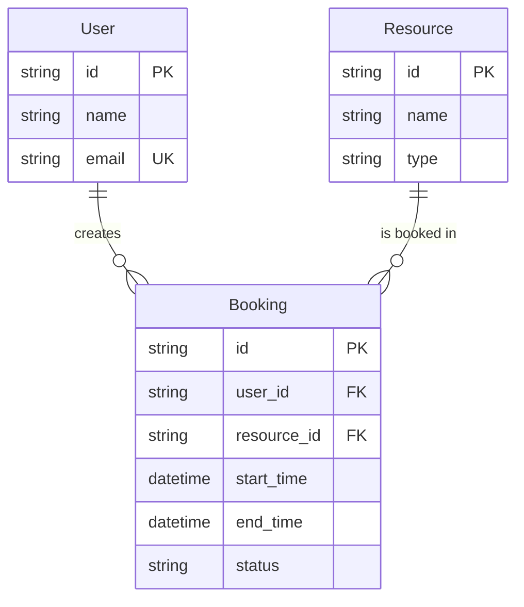

# Лабораторна робота 1: CRUD — «зроби як вмієш»

## Мета

Отримати працюючий baseline. Студенти пишуть код так, як звикли, без нав'язаних патернів. Цей код стане відправною точкою для рефакторингу в наступних лабораторних.

## Завдання

### 1. Описати юзкейси системи

Перед написанням коду необхідно формалізувати, що саме система має робити. Скласти перелік юзкейсів (use cases) для системи бронювання.

Для кожного юзкейсу вказати:
- **Назва** (наприклад, «Створення бронювання»)
- **Актор** — хто ініціює (клієнт, адміністратор)
- **Передумови** — що має бути виконано до початку
- **Основний сценарій** — кроки успішного виконання
- **Альтернативні сценарії / помилки** — що відбувається при невалідних даних, конфліктах тощо

Мінімальний набір юзкейсів:
- Реєстрація та вхід користувача
- Перегляд доступних ресурсів
- Створення бронювання (з перевіркою доступності слоту)
- Скасування бронювання
- Перегляд бронювань користувача

Юзкейси розмістити в `docs/use-cases.md` у репозиторії.

### 2. Створити діаграму даних

Створити ER-діаграму (Entity-Relationship), що описує структуру даних системи:
- Сутності та їхні атрибути
- Зв'язки між сутностями (1:N, N:M тощо)
- Ключові обмеження (primary key, foreign key, unique)

Діаграму можна створити за допомогою:
- Mermaid (прямо в `.md` файлі)
- dbdiagram.io, draw.io або аналогічного інструменту (зберегти як зображення в `docs/`)

Приклад мінімальної ER-діаграми (Mermaid):


Діаграму розмістити в `docs/er-diagram.md` (або як зображення в `docs/`).

### 3. Реалізувати API для системи бронювання

Мова та фреймворк — на вибір студента. База даних — на вибір студента (з обґрунтуванням в ADR).

**Сутності та операції:**

| Сутність | Операції |
|----------|----------|
| **User** | Створення, читання, оновлення, видалення |
| **Resource** (кімната / кабінет / зал) | Створення, читання, оновлення, видалення |
| **Booking** (бронювання з часовим слотом) | Створення, читання, скасування |

**Бізнес-правила (інваріанти):**

Для створення та оновлення сутностей обов'язкові **інваріанти** — правила, які завжди повинні виконуватись:

- Не можна створити бронювання на вже зайнятий часовий слот для того самого ресурсу
- Часовий слот має містити час початку та час завершення
- Часовий діапазон має бути коректним (початок < кінець)
- Часовий слот не може бути в минулому
- Email користувача повинен бути валідним
- Бронювання має бути прив'язане до існуючого користувача та ресурсу
- Інші правила, специфічні для вашого домену

**API:**
- REST API з коректними HTTP-методами та статус-кодами
- Ендпоінти для всіх операцій з кожною сутністю
- Обробка помилок: коректні HTTP-статуси (400 для невалідних даних, 404 для неіснуючих ресурсів, 409 для конфлікту слотів)

### 4. Додати автентифікацію

- Реалізувати реєстрацію та вхід користувача
- Механізм на ваш вибір: cookies або JWT
- Захистити ендпоінти — неавторизовані запити повертають `401`

### 5. Написати тести

Дотримуватись піраміди тестування:

**Unit-тести:**
- Логіка валідації вхідних даних
- Перевірка бізнес-правил (перетин часових слотів, валідність діапазону тощо)

**Integration-тести:**
- Тести API-ендпоінтів (HTTP-запит → відповідь)
- Перевірка коректної роботи з базою даних
- Перевірка сценаріїв помилок (конфлікт слотів, неіснуючий ресурс)

### 6. Налаштувати CI

GitHub Actions workflow, що запускається на push та pull request:
- Збірка проєкту
- Лінтер
- Unit-тести
- Integration-тести

## Вимоги до проєкту

### Репозиторій

- Проєкт розміщено в **Git-репозиторії** (GitHub)
- У корені — `README.md` з:
  - Коротким описом проєкту
  - Інструкцією як запустити проєкт локально
  - Інструкцією як прогнати тести
  - Переліком використаних технологій

### Git Flow

Робота ведеться в команді. Дотримуватись наступного процесу:

**Гілки:**
- `main` — стабільна гілка, містить лише перевірені релізи
- `dev` — гілка розробки, сюди мерджаться всі зміни

**Процес роботи:**
1. Для кожної задачі створюється окрема гілка від `dev` (наприклад, `feature/add-booking-api`, `fix/slot-validation`)
2. Після завершення роботи — створюється **Pull Request** в `dev`
3. PR повинен пройти CI (тести зелені) перед мерджем
4. PR повинен отримати **code review та approve** від щонайменше одного іншого члена команди
5. Коли лабораторна готова — створюється PR з `dev` у `main` та додається **тег релізу**

**Code Review:**
- Кожен PR переглядається іншим членом команди перед мерджем
- Рев'ювер перевіряє: читабельність коду, відповідність завданню, наявність тестів, відсутність очевидних помилок
- Рев'ювер залишає коментарі або approve
- Автор PR відповідає на коментарі та вносить правки за потреби
- Мерджити без approve **заборонено**

**Теги релізів:**
- Формат: `lab-N.X`, де `N` — номер лабораторної, `X` — версія здачі
- Перша здача: `lab-1.0`, `lab-2.0`, ...
- Виправлення після захисту лаборатрної (якщо необхідно): `lab-1.1`, `lab-1.2`, ...
- Тег ставиться на коміт у `main`, який відповідає здачі лабораторної
- Це дозволяє викладачу переключитися на конкретну версію для перевірки

**Conventional Commits:**

Усі коміти мають відповідати формату [Conventional Commits](https://www.conventionalcommits.org/):

```
<тип>(<область>): <опис>
```

Основні типи:
| Тип | Коли використовувати |
|-----|---------------------|
| `feat` | Нова функціональність (`feat(booking): add create endpoint`) |
| `fix` | Виправлення помилки (`fix(booking): handle overlapping slots`) |
| `test` | Додавання або зміна тестів (`test(booking): add slot conflict test`) |
| `docs` | Зміни в документації (`docs: add ADR for database choice`) |
| `ci` | Зміни в CI/CD (`ci: add GitHub Actions workflow`) |
| `refactor` | Рефакторинг без зміни поведінки (`refactor(user): extract validation`) |
| `chore` | Рутинні задачі (`chore: update dependencies`) |

### CI (GitHub Actions)

Налаштувати GitHub Actions pipeline, який при кожному push / pull request в `dev` та `main` виконує:
1. **Build** — збірка проєкту
2. **Lint** — перевірка кодстайлу (лінтер на вибір відповідно до мови)
3. **Test** — прогон unit-тестів та integration-тестів

Pipeline має бути **зеленим** при здачі. Якщо тести не проходять — робота не приймається.

### ADR (Architecture Decision Records)

Створити папку `docs/adr/` в репозиторії. Написати ADR для ключових технологічних рішень:

1. **Вибір мови програмування та фреймворку** — чому саме ця мова, чому цей фреймворк, які альтернативи розглядалися
2. **Вибір бази даних** — чому обрано саме цю БД (реляційна, документна тощо), як вона підходить для домену бронювань

Формат ADR (спрощений):
```
# ADR-001: Назва рішення

## Статус
Прийнято

## Контекст
Що за проблема? Які обмеження?

## Рішення
Що вирішили і чому?

## Альтернативи
Що ще розглядали і чому відхилили?

## Наслідки
Які плюси та мінуси цього рішення?
```

## Що здати

| Артефакт | Опис |
|----------|------|
| Репозиторій | GitHub-репозиторій з гілками `main` та `dev` |
| README.md | Інструкції запуску та тестування |
| Юзкейси | `docs/use-cases.md` — опис сценаріїв використання системи |
| ER-діаграма | `docs/er-diagram.md` (або зображення в `docs/`) — структура даних |
| Git Flow | PR-и в `dev` з review та approve, реліз у `main` з тегом `lab-1.0` (фікси — `lab-1.1`, ...), conventional commits |
| ADR | `docs/adr/` — рішення щодо мови, фреймворку, БД |
| CI | Зелений GitHub Actions pipeline (build + lint + test) |
| Тести | Unit + integration, всі проходять |
| Автентифікація | Реєстрація, вхід, захищені ендпоінти (401 для неавторизованих) |
| API | Працюючий REST API для всіх сутностей |

## Критерії оцінювання

| Критерій | На що звернути увагу |
|----------|---------------------|
| Функціональність | Усі CRUD-операції працюють, бізнес-правила (інваріанти) виконуються |
| Автентифікація | Є реєстрація, вхід, захист ендпоінтів; неавторизовані запити повертають 401 |
| Юзкейси | Покривають основні сценарії, описані актори, передумови, альтернативні шляхи |
| ER-діаграма | Відображає сутності, атрибути, зв'язки; відповідає реалізації |
| Git Flow | Є `main` та `dev`, робота через PR з code review та approve, тег `lab-1.0` на `main` |
| Conventional Commits | Коміти відповідають формату, типи використані коректно |
| Тести | Є unit і integration тести, покривають основні сценарії та edge cases |
| CI | Pipeline налаштований, тести проходять автоматично |
| ADR | Рішення обґрунтовані, альтернативи розглянуті |
| README | Проєкт можна запустити за інструкцією |
| Бізнес-логіка | Де вона живе? (ймовірно в контролерах або сервісах упереміш з інфраструктурою — це нормально для лаби 1) |
| Моделі | Як пов'язані моделі БД і бізнес-логіка? (ймовірно це одне й те саме — це нормально для лаби 1) |
| Гнучкість | Наскільки легко було б змінити БД? (ймовірно складно — це стане мотивацією для лаби 2) |
